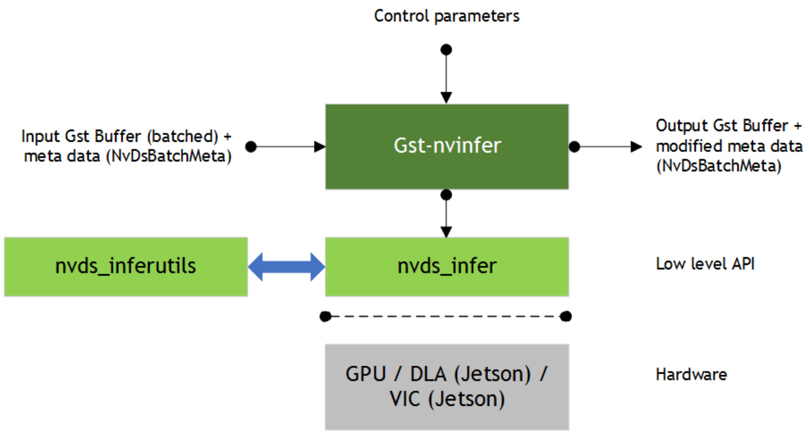

# DEEPSTREAM 4.0 PLUGIN MANUAL  

SWE-SWDOCDPSTR-002-PGRF  |  August 6, 2019 Advance Information  |  Subject to Change  

  

## DOCUMENT CHANGE HISTORY  

<html><body><table><tr><td>Date</td><td>Author</td><td>RevisionHistory</td></tr><tr><td>Nov.19,2018</td><td>BhushanRupde. JonathanSachs</td><td>Release3.0 (lnitialrelease)</td></tr><tr><td>Aug.6,2019</td><td>BhushanRupde JonathanSachs</td><td>Release 4.0 (Unified release)</td></tr></table></body></html>  

## TABLE OF CONTENTS  

1.0 Introduction 8   
2.0 GStreamer Plugin Details 9   
2.1 Gst-nvinfer. .. 9   
2.1.1 Inputs and Outputs. .11   
2.1.2 Features . .12   
2.1.3 Gst-nvinfer File Configuration Specifications . .14   
2.1.4 Gst Properties . .20   
2.1.5 Tensor Metadata . ..21   
2.1.6 Segmentation Metadata. .22   
2.2 Gst-nvtracker.. .22   
2.2.1 Inputs and Outputs. .24   
2.2.2 Features . .25   
2.2.3 Gst Properties .25   
2.2.4 Custom Low-Level Library . .26   
2.2.5 Low-Level Tracker Library Comparisons and Tradeoffs .29   
2.2.6 NvDCF Low-Level Tracker . .30   
2.3 Gst-nvstreammux. .32   
2.3.1 Inputs and Outputs. ..34   
2.3.2 Features .34   
2.3.3 Gst Properties . .35   
2.4 Gst-nvstreamdemux. .36   
2.4.1 Inputs and Outputs. .37   
2.5 Gst-nvmultistreamtiler . .38   
2.5.1 Inputs and Outputs. .38   
2.5.2 Features .39   
2.5.3 Gst Properties .39   
2.6 Gst-nvdsosd. .40   
2.6.1 Inputs and Outputs. .41   
2.6.2 Features .. .42   
2.6.3 Gst Properties . .42   
2.7 Gst-nvvideoconvert . .43   
2.7.1 Inputs and Outputs. .43   
2.7.2 Features .44   
2.7.3 Gst Properties . .44   
2.8  Gst-nvdewarper. .45   
2.8.1 Inputs and Outputs. .46   
2.8.2 Features ... .46   
2.8.3 Configuration File Parameters . .47   
2.8.4 Gst Properties .49   
2.9 Gst-nvof . .50   
2.9.1 Inputs and Outputs. .51   
2.9.2 Features .51   
2.9.3 Gst Properties .52  

#### 2.10 Gst-nvofvisual. 3  

2.10.1 Inputs and Outputs. .53   
2.10.2 Features . .54   
2.10.3 Gst Properties ..54   
2.11 Gst-nvsegvisual . .54   
2.11.1 Inputs and Outputs.. ..55   
2.11.2 Gst Properties .56   
2.12 Gst-nvvideo4linux2. ...56   
2.12.1 Decoder . .57   
2.12.1.1 Inputs and Outputs.. .57   
2.12.1.2 Features . ...58   
2.12.1.3 Configuration Parameters . ...58   
2.12.2 Encoder . ..59   
2.12.2.1 Inputs and Outputs.. .59   
2.12.2.2 Features . ..59   
2.12.2.3 Configuration Parameters . .59   
2.13 Gst-nvjpegdec . ..60   
2.13.1 Inputs and Outputs. ..60   
2.13.2 Features . ..61   
2.13.3 Configuration Parameters .... ...61   
2.14 Gst-nvmsgconv. ..61   
2.14.1 Inputs and Outputs. ...62   
2.14.2 Features . .62   
2.14.3 Gst Properties .63   
2.14.4 Schema Customization . ..64   
2.14.5 Payload with Custom Objects. .64   
2.15 Gst-nvmsgbroker . ..64   
2.15.1 Inputs and Outputs. ..65   
2.15.2 Features . ...65   
2.15.3 Gst Properties ..66   
2.15.4 nvds_msgapi: Protocol Adapter Interface . .66   
2.15.4.1 nvds_msgapi_connect(): Create a Connection... ....67   
2.15.4.2 nvds_msgapi_send() and nvds_msgapi_send_async(): Send an event ...8   
2.15.4.3 nvds_msgapi_.do_work(): Incremental Execution of Adapter Logic .......69   
2.15.4.4 nvds_msgapi_disconnect(): Terminate a Connection... ...70   
2.15.4.5 nvds_msgapi_getversion(): Get Version Number .... ....70   
2.15.5 nvds_kafka_proto: Kafka Protocol Adapter.. .70   
2.15.5.1 Installing Dependencies... .70   
2.15.5.2 Using the Adapter... .71   
2.15.5.3 Configuring Protocol Settings ... .71   
2.15.5.4 Programmatic Integration ... ...72   
2.15.5.5 Monitor Adapter Execution ... .72   
2.15.6  Azure MQTT Protocol Adapter Libraries... ..73   
2.15.6.1 Installing Dependencies. .73   
2.15.6.2 Setting Up Azure IoT.. .74   
2.15.6.3 Configuring Adapter Settings .74   
2.15.6.4 Using the Adapter.. .75   
2.15.6.5 Monitor Adapter Execution . ..76   
2.15.6.6 Message Topics and Routes.. .77   
2.15.7 AMQP Protocol Adapter . .77   
2.15.7.1 Installing Dependencies.... ..77   
2.15.7.2 Configure Adapter Settings..... ..79   
2.15.7.3 Using the adapter .... ..79   
2.15.7.4 Programmatic Integration . ..80   
2.15.7.5 Monitor Adapter Execution . ...81   
2.15.8 nvds_logger: Logging Framework.. ..81   
2.15.8.1 Enabling Logging . .81   
2.15.8.2 Filtering Logs .. .82   
2.15.8.3 Retiring and Managing Logs ..82   
2.15.8.4 Generating Logs .. .82   
0 MetaData in the DeepStream SDK. 84   
3.1 NvDsBatchMeta: Basic Metadata Structure .84   
3.2 User/Custom Metadata Addition inside NvDsBatchMeta .85   
3.3 Adding Custom Meta in Gst Plugins Upstream from Gst-nvstreammux ..... .86   
4.0 IPlugin Interface ... 87   
4.1 How to Use IPluginCreator . .87   
4.2 How to Use IPluginFactory . .88   
5.0 Docker Containers.. 90   
5.1 A Docker Container for dGPU .90   
5.2 A Docker Container for Jetson . .91   
6.0 Troubleshooting 92  

## LIST OF FIGURES  

Figure 1. Gst-nvinfer inputs and outputs. 11   
Figure 2. Gst-nvtracker inputs and outputs. 24   
Figure 3. The Gst-nvstreammux plugin .. .. 34   
Figure 4. The Gst-nvstreamdemux plugin . 37   
Figure 5. The Gst-nvmultistreamtiler plugin .. 38   
Figure 6. The Gst-nvdsosd plugin. . 41   
Figure 7. The Gst-nvvideoconvert plugin. . 43   
Figure 8. The Gst-nvdewarper plugin. . 46   
Figure 9. The Gst-nvof plugin. . 51   
Figure 10. The Gst-nvofvisual plugin .. . 53   
Figure 11. The Gst-nvsegvisual plugin . . 55   
Figure 12. The Gst-nvvideo4linux2 decoder plugin . 57   
Figure 13. The Gst-nvmsgconv plugin.. . 62   
Figure 14. The Gst-nvmsgbroker plugin . 65   
Figure 15. The Gst-nvmsgbroker plugin calling the nvds_msgapi interface.. ... 67   
Figure 16. DeepStream metadata hierarchy ... . 85  

## LIST OF TABLES  

Table 1. Features of the Gst-nvinfer plugin . . 12   
Table 2. Gst-nvinfer plugin, [property] group, supported keys . 15   
Table 3. Gst-nvinfer plugin, [class-attrs-..-] groups, supported keys. . 19   
Table 4. Gst-nvinfer plugin, Gst properties... . 21   
Table 5. Features of the Gst-nvtracker plugin . .. 25   
Table 6. Gst-nvtracker plugin, Gst Properties... ... 25   
Table 7. Tracker library comparison. . 29   
Table 8. NvDCF low-level tracker, configuration properties . . 31   
Table 9. Features of the Gst-nvstreammux plugin. . 35   
Table 10. Gst-nvstreammux plugin, Gst properties . . 35   
Table 11. Features of the Gst-nvmultistreamtiler plugin . 39   
Table 12. Gst-nvmultistreamtiler plugin, Gst properties . 39   
Table 13. Features of the Gst-nvdsosd plugin .. 42   
Table 14. Gst-nvdsosd plugin, Gst Properties 42   
Table 15. Gst-nvvideoconvert plugin, Gst Properties . 44   
Table 16. Features of the Gst-nvdewarper plugin . 46   
Table 17. Gst-nvdewarper plugin, configuration file, [surface<n>] parameters ... . 47   
Table 18. Gst-nvdewarper plugin, Gst properties ... . 49   
Table 19. Features of the Gst-nvof plugin . .. 52   
Table 20. Gst-nvof plugin, Gst properties . 52   
Table 21. Features of the Gst-nvofvisual plugin 54   
Table 22. Gst-nvofvisual plugin, Gst Properties. 54   
Table 23. Features of the Gst-nvsegvisual plugin . 55   
Table 24. Gst-nvsegvisual plugin, Gst Properties . . 56   
Table 25. Features of the Gst-nvmsgconv plugin .. .. 63   
Table 26. Gst-nvmsgconv plugin, Gst properties. . 63   
Table 27. Features of the Gst-nvmsgbroker plugin . . 66   
Table 28. Gst-nvmsgbroker plugin, Gst Properties . 66  

## 1.0 INTRODUCTION  

DeepStream SDK is based on the GStreamer framework. This manual describes the DeepStream GStreamer plugins and the DeepStream input, outputs, and control parameters.  

DeepStream SDK is supported on systems that contain an NVIDIA® Jetson™ module or an NVIDIA dGPU adapter.1  

The manual is intended for engineers who want to develop DeepStream applications or additional plugins using the DeepStream SDK. It also contains information about metadata used in the SDK. Developers can add custom metadata as well.  

The manual describes the methods defined in the SDK for implementing custom inferencing layers using the IPlugin interface of TensorRT™.  

You can refer the sample examples shipped with the SDK as you use this manual to familiarize yourself with DeepStream application and plugin development.  

## 2.0 GSTREAMER PLUGIN DETAILS  

### 2.1 GST-NVINFER  

The Gst-nvinfer plugin does inferencing on input data using NVIDIA® TensorRT™.  

The plugin accepts batched NV12/RGBA buffers from upstream. The NvDsBatchMeta structure must already be attached to the Gst Buffers.  

The low-level library (libnvds_infer) operates on any of INT8 RGB, BGR, or GRAY data with dimension of Network Height and Network Width.  

The Gst-nvinfer plugin performs transforms (format conversion and scaling), on the input frame based on network requirements, and passes the transformed data to the low-level library.  

The low-level library preprocesses the transformed frames (performs normalization and mean subtraction) and produces final float RGB/BGR/GRAY planar data which is passed to the TensorRT engine for inferencing. The output type generated by the low-level library depends on the network type.  

The pre-processing function is:  

$$
y=n e t-s c a l e-f a c t o r*(x-m e a n)
$$  

Where:  

 $x$ is the  input pixel value. It is an int8 with range [0,255].   
 mean is the corresponding mean value, read either from the mean file or as offsets[c], where $\subset$ is the channel to which the input pixel belongs, and offsets is the array specified in the configuration file. It is a float.   
$\blacktriangleright$ net-scale-factor is the pixel scaling factor specified in the configuration file. It is a float.   
 $y$ is the corresponding output pixel value. It is a float.  

nvinfer currently works on the following type of networks:  

Multi-class object detection Multi-label classification Segmentation  

The Gst-nvinfer plugin can work in two modes:  

Primary mode: Operates on full frames   
Secondary mode: Operates on objects added in the meta by upstream   
components  

When the plugin is operating as a secondary classifier along with the tracker, it tries to improve performance by avoiding re-inferencing on the same objects in every frame. It does this by caching the classification output in a map with the object’s unique ID as the key. The object is inferred upon only when it is first seen in a frame (based on its object ID) or when the size (bounding box area) of the object increases by $20\%$ or more. This optimization is possible only when the tracker is added as an upstream element.  

Detailed documentation of the TensorRT interface is available at:  

https://docs.nvidia.com/deeplearning/sdk/tensorrt-developerguide/index.html  

The plugin supports the IPlugin interface for custom layers. Refer to section IPlugin Interface for details.  

The plugin also supports the interface for custom functions for parsing outputs of object detectors and initialization of non-image input layers in cases where there are more than one input layer.  

Refer to sources/includes/nvdsinfer_custom_impl.h for the custom method implementations for custom models.  

  
Figure 1. Gst-nvinfer inputs and outputs  

Downstream components receive a Gst Buffer with unmodified contents plus the metadata created from the inference output of the Gst-nvinfer plugin.  

The plugin can be used for cascaded inferencing. That is, it can perform primary inferencing directly on input data, then perform secondary inferencing on the results of primary inferencing, and so on. See the sample application deepstream-test2 for more details.  

#### 2.1.1 Inputs and Outputs  

This section summarizes the inputs, outputs, and communication facilities of the Gstnvinfer plugin.  

Inputs  

Gst Buffer   
NvDsBatchMeta (attaching NvDsFrameMeta)   
Caffe Model and Caffe Prototxt   
ONNX   
UFF file   
TLT Encoded Model and Key   
Offline: Supports engine files generated by Transfer Learning Toolkit SDK Model   
converters  

Layers: Supports all layers supported by TensorRT, see:  

https://docs.nvidia.com/deeplearning/sdk/tensorrt-developerguide/index.html  

Control parameters: Gst-nvinfer gets control parameters from a configuration file. You can specify this by setting the property config-file-path. For details, see Gst-nvinfer File Configuration Specifications. Other control parameters that can be set through GObject properties are:  

Batch size   
Inference interval   
Attach inference tensor outputs as buffer metadata  

The parameters set through the GObject properties override the parameters in the Gst-nvinfer configuration file.  

Outputs  

Gst Buffer Depending on network type and configured parameters, one or more of: ― NvDsObjectMeta NvDsClassifierMeta ― NvDsInferSegmentationMeta ― NvDsInferTensorMeta  

#### 2.1.2 Features  

Table 1 summarizes the features of the plugin.  

Table 1. Features of the Gst-nvinfer plugin   

<html><body><table><tr><td>Feature</td><td>Description</td><td>Release</td></tr><tr><td>Transfer-Learning-Toolkit encoded model support</td><td></td><td>DS 4.0</td></tr><tr><td>Gray input model support</td><td>Support for models with single channel gray input</td><td>DS 4.0</td></tr><tr><td>Tensoroutputasmeta</td><td>Raw tensor output is attached as meta data to Gst Buffers and flowed through the pipeline</td><td>DS 4.0</td></tr><tr><td>Segmentation model</td><td>Supports segmentation model</td><td>DS 4.0</td></tr><tr><td>Maintain input aspect ratio</td><td>Configurable support for maintaining aspect ratio when scaling input frame to networkresolution</td><td>DS 4.0</td></tr></table></body></html>  

<html><body><table><tr><td>Feature</td><td>Description</td><td>Release</td></tr><tr><td>Custom cuda engine creation interface</td><td>Interface for generating CUDA engines from TensorRT INetworkDefinition and IBuilder APls instead of model files</td><td>DS 4.0</td></tr><tr><td>Caffe Model support</td><td></td><td>DS 2.0</td></tr><tr><td>UFF Model support</td><td></td><td>DS 3.0</td></tr><tr><td>ONNX Model support</td><td>一</td><td>DS 3.0</td></tr><tr><td>Multiple modes ofoperation</td><td>Support for cascaded inferencing</td><td>DS 2.0</td></tr><tr><td>Asynchronous mode of operation for secondary inferencing</td><td>Infer asynchronously for secondary classifiers</td><td>DS 2.0</td></tr><tr><td>Grouping using CV::Group rectangles</td><td>For detector bounding box clustering User can configure batch size for</td><td>DS 2.0</td></tr><tr><td>Configurable batch-size processing</td><td>processing</td><td>DS 2.0</td></tr><tr><td>No Restriction on number of output blobs Configurable number of detected classes</td><td>Supports any number of output blobs Supports configurable number of detected</td><td>DS 3.0</td></tr><tr><td>(detectors)</td><td>classes</td><td>DS 3.0</td></tr><tr><td>Support for Classes: configurable (> 32) Application access to raw inference output</td><td>Support any number of classes Application can access inference output</td><td>DS 3.0 DS 3.0</td></tr><tr><td></td><td>buffers for user specified layer</td><td></td></tr><tr><td>Support for single shot detector (SSD) Secondary GPU Inference Engines (GIEs)</td><td>Support secondary inferencing as detector</td><td>DS 3.0 DS 2.0</td></tr><tr><td>operate as detector on primary bounding box</td><td></td><td></td></tr><tr><td>Multiclass secondary support Grouping using DBSCAN</td><td>Support multiple classifier network outputs For detector bounding box clustering</td><td>DS 2.0 DS 3.0</td></tr><tr><td>Loading an external lib containing IPlugin</td><td>Supports loading (dlopen () ) a library</td><td>DS 3.0</td></tr><tr><td>implementation for custom layers (IPluginCreator & IPluginFactory) Multi GPU</td><td>containing IPlugin implementation for custom layers Select GPU onwhichwewant torun</td><td></td></tr><tr><td>Detection width height configuration</td><td>inference Filter out detected objects based on</td><td>DS 2.0</td></tr><tr><td>Allow user to register custom parser</td><td>min/max object size threshold</td><td>DS 2.0</td></tr><tr><td>Bounding box filtering based on</td><td>Supports final output layer bounding box parsing for custom detector network</td><td>DS 2.0</td></tr><tr><td>configurable object size Configurable operation interval</td><td>Supports inferencing in secondary mode objects meeting min/max size threshold Interval for inferencing (number of batched</td><td>DS 2.0 DS 2.0</td></tr><tr><td></td><td>buffers skipped)</td><td></td></tr><tr><td>Select Top and bottom regions of interest (Rols)</td><td>Removes detected objects in top and bottom areas</td><td>DS 2.0</td></tr><tr><td>Operate on Specific object type (Secondary mode)</td><td>Process only objects of define classes for secondary inferencing</td><td>DS 2.0</td></tr></table></body></html>  

<html><body><table><tr><td>Feature</td><td>Description</td><td>Release</td></tr><tr><td>Configurable blob names for parsing bounding box (detector)</td><td>Support configurable names for output blobs for detectors</td><td>DS 2.0</td></tr><tr><td>Allow configuration file input</td><td>Support configuration file as input (mandatory in DS 3.0)</td><td>DS 2.0</td></tr><tr><td>Allow selection of class id for operation</td><td>Supports secondary inferencing based on class ID</td><td>DS 2.0</td></tr><tr><td>Support for Full Frame Inference: Primary as a classifier</td><td>Can work as classifier as well in primary mode</td><td>DS 2.0</td></tr><tr><td>Multiclass secondary support</td><td>Support multiple classifier network outputs</td><td>DS 2.0</td></tr><tr><td>Secondary GlEs operate as detector on primary bounding box</td><td></td><td>DS 2.0</td></tr><tr><td>Support secondary inferencing as detector Supports FP16,FP32 and INT8 models FP16 and INT8 are platform dependent</td><td></td><td>DS 2.0</td></tr><tr><td>Supports TensorRT Engine file as input</td><td></td><td>DS 2.0</td></tr><tr><td>Inference input layer initialization Initializing non-video input layers in case of</td><td></td><td>DS 3.0</td></tr><tr><td>more than one input layers</td><td></td><td></td></tr><tr><td>Support for FasterRCNN Support for Yolo detector (YoloV3/V3- tiny/V2/V2-tiny)</td><td>一</td><td>DS 3.0 DS 4.0</td></tr></table></body></html>  

#### 2.1.3 Gst-nvinfer File Configuration Specifications  

The Gst-nvinfer configuration file uses a “Key File” format described in:  

https://specifications.freedesktop.org/desktop-entry-spec/latest  

The [property] group configures the general behavior of the plugin. It is the only mandatory group.  

The [class-attrs-all] group configures detection parameters for all classes.  

The [class-attrs-<class-id>] group configures detection parameters for a class specified by <class-id>. For example, the [class-attrs-23] group configures detection parameters for class ID 23. This type of group has the same keys as [classattrs-all].  

Table 2 and Table 3, respectively describe the keys supported for [property] groups and [class-attrs-…] groups.  

Table 2. Gst-nvinfer plugin, [property] group, supported keys   

<html><body><table><tr><td colspan="5">Network Types / Applicable to GlEs (Primary/Seconday)</td></tr><tr><td>Property</td><td>Meaning</td><td>Type and Range</td><td>Example Notes</td><td></td></tr><tr><td>num-detected- classes</td><td>Number of classes detected by the network</td><td>Integer, >0</td><td>num-detected- classes=91</td><td>Detector Both</td></tr><tr><td>net-scale-factor</td><td>Pixel normalization factor</td><td>Float, >0.0</td><td>net-scale-factor= 0.031</td><td>All Both</td></tr><tr><td>model-file</td><td>Pathname of the caffemodel file. Not required if model- engine-file is used</td><td>String</td><td>model-file=/home/ ubuntu/ model.caffemodel</td><td>All Both</td></tr><tr><td>proto-file</td><td>Pathname of the prototxt file. Not required if model-engine-file is used</td><td>String</td><td>proto-file=/home/ ubuntu/ model.prototxt</td><td>All Both</td></tr><tr><td>int8-calib-file</td><td>Pathname of the INT8 calibration file for dynamic range adjustment with anFP32 model</td><td>String</td><td>int8-calib-file= /home/ubuntu/ int8_calib</td><td>AII Both</td></tr><tr><td>batch-size</td><td>Number of frames or objects to be inferred together in a batch</td><td>Integer, >0</td><td>batch-size=30</td><td>All Both</td></tr><tr><td>model-engine-file</td><td>Pathname of the serialized model engine file</td><td>String</td><td>model-engine-file= /home/ubuntu/ model.engine</td><td>AlIl Both</td></tr><tr><td>uff-file</td><td>Pathname of the UFF model file</td><td>String</td><td>uff-file=/home/ ubuntu/model.uff</td><td>All Both</td></tr><tr><td>onnx-file</td><td>Pathname of the ONNX model file</td><td>String</td><td>onnx-file=/home/ ubuntu/model.onnx</td><td>All Both</td></tr><tr><td>enable-dbscan</td><td>Indicates whether to use DBSCAN or the OpenCV groupRectangles () function for grouping detected objects</td><td>Boolean</td><td>enable-dbscan=1</td><td>Detector Both</td></tr><tr><td>labelfile-path</td><td>Pathname ofa textfile containing the labels for the model</td><td>String</td><td>labelfile-path= /home/ubuntu/ model_labels.txt</td><td>Detector& classifier Both</td></tr><tr><td>mean-file</td><td>Pathname of mean data file (PPM format)</td><td>String</td><td>mean-file=/home/ ubuntu/ model_meanfile.pp m</td><td>All Both</td></tr></table></body></html>  

<html><body><table><tr><td colspan="4">Network Types / Applicable to GlEs (Primary/Seconday)</td><td rowspan="2"></td></tr><tr><td>Property</td><td>Meaning</td><td>Type and Range</td><td>Example Notes</td></tr><tr><td>gie-unique-id</td><td>Unique ID to be assigned to the GlE to enable the application and other elements to identify detected bounding boxes</td><td>Integer, >0</td><td>gie-unique-id=2</td><td>AIl Both</td></tr><tr><td>operate-on-gie-id</td><td>and labels Unique ID of the GlE on whose metadata (bounding boxes) this GIE is to operate on</td><td>Integer, >0</td><td>operate-on-gie-id=1</td><td>All Both</td></tr><tr><td>operate-on-class- ids</td><td>Class IDs of the parent GIE on which this GlE is to operate on</td><td>Semicolon delimited integer array</td><td>operate-on-class- ids=1;2 Operates on objects with class IDs 1,2 generated by parent</td><td>AII Both</td></tr><tr><td>interval</td><td>Specifies the number of consecutivebatchestobe skipped for inference</td><td>Integer, >0</td><td>GIE interval=1</td><td>AII Primary</td></tr><tr><td>input-object-min- width</td><td>Secondary GIE infers only on objects with this minimum width</td><td>Integer, ≥0</td><td>input-object-min- width=40</td><td>AII Secondary</td></tr><tr><td>input-object-min- height</td><td>Secondary GlEinfers only on objects with this minimum height</td><td>Integer, ≥0</td><td>input-object-min- height=40</td><td>All Secondary</td></tr><tr><td>input-object-max- width</td><td>Secondary GlE infers only on objects with this maximum width</td><td>Integer, ≥0</td><td>input-object-max- width=256 0 disablesthe threshold</td><td>AII Secondary</td></tr><tr><td>input-object-max- height</td><td>Secondary GIE infers only on objects with this maximum height</td><td>Integer, ≥0</td><td>input-object-max- height=256 0 disables the threshold</td><td>AII Secondary</td></tr><tr><td>uff-input-dims</td><td>Dimensions of the UFF model</td><td>channel; height; width; input-order All integers,</td><td>input- dims=3;224;224;0 Possiblevaluesfor input-order are: 0:NCHW 1:NHWC</td><td>AII Both</td></tr><tr><td>network-mode</td><td>Dataformattobeusedby inference</td><td>Integer 0:FP32 1: INT8 2: FP16</td><td>network-mode=0</td><td>All Both</td></tr></table></body></html>  

<html><body><table><tr><td colspan="5">Network Types / Applicable to GlEs (Primary/Seconday)</td></tr><tr><td>Property</td><td>Meaning Array of meanvalues of</td><td>Type and Range</td><td>Example Notes</td><td></td></tr><tr><td>offsets</td><td>color components to be subtracted from each pixel. Array length must equal the number of color components in the frame. The plugin multiplies mean values by net- scale-factor.</td><td>Semicolon delimited float array, all values ≥0</td><td>offsets=77.5;21.2;11 .8</td><td>AII Both</td></tr><tr><td>output-blob-names</td><td>Array of output layer names</td><td>Semicolon delimited string array</td><td>For detector: output-blob- names=coverage;bb oX For multi-label classifiers: output-blob- names=coverage_att rib1;coverage_attrib 2</td><td>AlI Both</td></tr><tr><td>parse-bbox-func- name</td><td>Name of the custom bounding box parsing function. If not specified, Gst-nvinfer uses the internal function for the resnet model provided by the SDK.</td><td>String</td><td>parse-bbox-func- name= parse_bbox_resnet</td><td>Detector Both</td></tr><tr><td>custom-lib-path</td><td>Absolute pathname of a library containing custom method implementations for custom models</td><td>String</td><td>custom-lib-path= /home/ubuntu/ libresnet_custom_im pl.so</td><td>All Both</td></tr><tr><td>model-color- format</td><td>Color format required by the model.</td><td>Integer 0:RGB 1:BGR</td><td>model-color- format=0</td><td>All Both</td></tr></table></body></html>  

<html><body><table><tr><td colspan="4">Network Types / Applicable to GlEs (Primary/Seconday)</td><td></td></tr><tr><td>Property</td><td>Meaning</td><td>Type and Range</td><td>Example Notes</td><td></td></tr><tr><td>classifier-async- mode</td><td>Enables inference on detected objects and asynchronous metadata attachments. Works only when tracker-ids are attached. Pushes buffer downstream without waiting forinference results. Attaches metadata after the inference results are available tonextGst Buffer in its internal</td><td>Boolean</td><td>classifier-async- mode=1</td><td>Classifier Secondary</td></tr><tr><td>process-mode</td><td>queue. Mode (primary or secondary) in which the element is to operate on</td><td>Integer 1=Primary 2=Secondary</td><td>gie-mode=1</td><td>AlIl Both</td></tr><tr><td>classifier-threshold</td><td>Minimum threshold label probability. The GIE outputs the label having the highest probability if it is greater than this threshold</td><td>Float, ≥0</td><td>classifier- threshold=0.4</td><td>Classifier Both</td></tr><tr><td>uff-input-blob- name</td><td>Nameof the inputblob in the UFF file</td><td>String</td><td>uff-input-blob- name=lnput_1</td><td>All Both</td></tr><tr><td>secondary-reinfer- interval</td><td>Reinference intervalfor objects, in frames</td><td>Integer, ≥0</td><td>secondary-reinfer- interval=15</td><td>Classifier Secondary</td></tr><tr><td>output-tensor- meta</td><td>Gst-nvinferattachesraw tensor output as Gst Buffer metadata.</td><td>Boolean</td><td>output-tensor- meta=1</td><td>AlIl Both</td></tr><tr><td>enable-dla</td><td>Indicateswhethertouse the DLA engine for inferencing. Note: DLA is supported only on Jetson AGX XavierTM. Currently work in progress.</td><td>Boolean</td><td>enable-dla=1</td><td>AlIl Both</td></tr><tr><td>use-dla-core</td><td>DLA core to be used. Note: Supported only on Jetson AGX XavierTM. Currently work in progress.</td><td>Integer, ≥0</td><td>use-dla-core=0</td><td>AlIl Both</td></tr></table></body></html>  

<html><body><table><tr><td colspan="5">Network Types / Applicable to GlEs (Primary/Seconday)</td></tr><tr><td>Property</td><td>Meaning</td><td>Type and Range</td><td>Example Notes</td><td></td></tr><tr><td>network-type</td><td>Type of network</td><td>Integer 0:Detector 1: Classifier 2: Segmentatio n</td><td>network-type=1</td><td>AIl Both</td></tr><tr><td>maintain-aspect- ratio</td><td>Indicates whether to maintain aspect ratio while scaling input.</td><td>Boolean</td><td>maintain-aspect- ratio=1</td><td>AIl Both</td></tr><tr><td>parse-classifier- func-name</td><td>Name of the custom classifier output parsing function. If not specified, Gst-nvinfer uses the internal parsing function for softmax layers.</td><td>String</td><td>parse-classifier- func-name= parse_bbox_softmax</td><td>Classifier Both</td></tr><tr><td>custom-network- config</td><td>Pathname of the configuration file for customnetworksavailable in the custom interface for creating CUDA engines.</td><td>String</td><td>custom-network- config=/home/ ubuntu/ network.config</td><td>AlIl Both</td></tr><tr><td>tlt-encoded-model</td><td>PathnameoftheTransfer Learning Toolkit (TLT) encoded model.</td><td>String</td><td>tlt-encoded-model= /home/ubuntu/ model.etlt</td><td>AIl Both</td></tr><tr><td>tlt-model-key</td><td>Key for the TLT encoded model.</td><td>String</td><td>tlt-model-key=abc</td><td>AlIl Both</td></tr><tr><td>segmentation- threshold</td><td>Confidencethresholdfor the segmentation model to output a valid class for a pixel. If confidence is less than this threshold, class output for that pixel is -1.</td><td>Float, ≥0.0</td><td>segmentation- threshold=0.3</td><td>Segmentation Both</td></tr></table></body></html>  

Table 3. Gst-nvinfer plugin, [class-attrs-...] groups, supported keys   

<html><body><table><tr><td colspan="5">Detector or Classifier / Applicable to GlEs (Primary/Seconday)</td></tr><tr><td>Name</td><td>Description</td><td>Type and Range</td><td>Example Notes</td><td></td></tr><tr><td>threshold</td><td>Detectionthreshold</td><td>Float,>=0</td><td>threshold=0.5</td><td>Objectdetector Both</td></tr></table></body></html>  

<html><body><table><tr><td colspan="5">Detector or Classifier / Applicable to GIEs (Primary/Seconday)</td></tr><tr><td>Name</td><td>Description</td><td>Type and Range</td><td>Example Notes</td><td></td></tr><tr><td>eps</td><td>Epsilonvaluesfor OpenCV grouprectangles () function and DBSCAN algorithm</td><td>Float, >=0</td><td>eps=0.2</td><td>Object detector Both</td></tr><tr><td>group- threshold</td><td>Threshold value for rectangle merging for OpenCV grouprectangles() function</td><td>Integer, >=0</td><td>group-threshold=1 0disables the clustering functionality</td><td>Object detector Both</td></tr><tr><td>minBoxes</td><td>Minimum number of points required to form a dense region for DBSCAN algorithm</td><td>Integer, ≥0</td><td>minBoxes=1 0 disablesthe clustering functionality</td><td>Object detector Both</td></tr><tr><td>roi-top-offset</td><td>Offset of the Rol from the top of the frame. Only objects within the Rol are output.</td><td>Integer, ≥0</td><td>roi-top-offset=200</td><td>Object detector Both</td></tr><tr><td>roi-bottom- offset</td><td>Offsetof theRol from the bottom of the frame. Only objects within the Rol are output.</td><td>Integer, ≥0</td><td>roi-bottom- offset=200</td><td>Object detector Both</td></tr><tr><td>detected-min- W</td><td>Minimum width in pixels of detected objects tobe output by the GIE</td><td>Integer, ≥0</td><td>detected-min-w=64</td><td>Object detector Both</td></tr><tr><td>detected-min- h</td><td>Minimum height in pixels of detected objects to be output by the GIE</td><td>Integer, ≥0</td><td>detected-min-h=64</td><td>Object detector Both</td></tr><tr><td>detected-max- W</td><td>Maximum width in pixels of detected objects tobe output by the GIE</td><td>Integer, ≥0</td><td>detected-max- w=200 0 disablesthe property</td><td>Object detector Both</td></tr><tr><td>detected-max- h</td><td>Maximum height in pixels of detected objects tobe output by the GIE</td><td>Integer, ≥0</td><td>detected-max-h=200 0 disablesthe property</td><td>Object detector Both</td></tr></table></body></html>  

#### 2.1.4 Gst Properties  

The values set through Gst properties override the values of properties in the configuration file. The application does this for certain properties that it needs to set programmatically.  