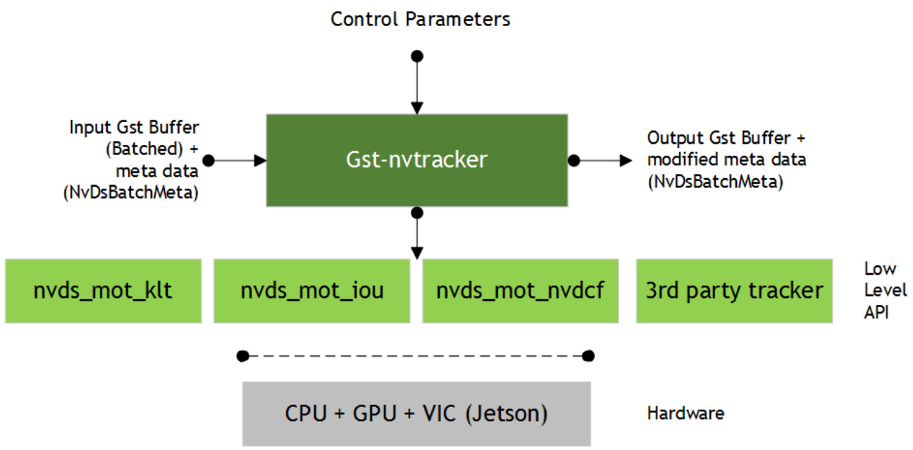

Table 4 describes the Gst-nvinfer plugin’s Gst properties.  

Table 4. Gst-nvinfer plugin, Gst properties   

<html><body><table><tr><td>Property</td><td>Meaning</td><td>Type and Range</td><td>Example Notes</td></tr><tr><td>config-file-path</td><td>Absolute pathname of configuration file for the Gst- nvinfer element</td><td>String</td><td>config-file-path= config_infer_primary.txt</td></tr><tr><td>process-mode</td><td>Infer Processing Mode 1=Primary Mode 2=Secondary Mode</td><td>Integer, 1 or 2</td><td>process-mode=1</td></tr><tr><td>unique-id</td><td>Unique ID identifying metadata generated by this GIE</td><td>Integer, 0 to 4,294,967,295</td><td>unique-id=1</td></tr><tr><td>infer-on-gie-id</td><td>See operate-on-gie-id in the configuration file table</td><td>Integer, 0 to 4,294,967,295</td><td>infer-on-gie-id=1</td></tr><tr><td>infer-on-class-ids</td><td>See operate-on-class-ids in the configuration file table</td><td>An array of colon- separated integers (class-ids)</td><td>infer-on-class-ids=1:2:4</td></tr><tr><td>model-engine-file</td><td>Absolute pathname of the pre- generated serialized engine file for the mode</td><td>String</td><td>model-engine-file= model_b1_fp32.engine</td></tr><tr><td>batch-size</td><td>Number of frames/objects to be inferred together in a batch</td><td>Integer, 1-4,294,967,295</td><td>batch-size=4</td></tr><tr><td>Interval</td><td>Number of consecutive batches to be skipped for inference</td><td>Integer, 0 to 32</td><td>interval=0</td></tr><tr><td>gpu-id</td><td>Device ID of GPU to use for pre-processing/inference (dGPU only)</td><td>Integer, 0-4,294,967,295</td><td>gpu-id=1</td></tr><tr><td>raw-output-file- write</td><td>Pathname of raw inference output file</td><td>Boolean</td><td>raw-output-file-write=1</td></tr><tr><td>raw-output- generated- callback</td><td>Pointer to the raw output generated callbackfunction</td><td>Pointer</td><td>Cannot be set through gst- launch</td></tr><tr><td>raw-output- generated- userdata</td><td>Pointer to user data to be supplied with raw-output- generated-callback</td><td>Pointer</td><td>Cannot be set through gst- launch</td></tr><tr><td>output-tensor- meta</td><td>Indicates whether to attach tensor outputs as meta on GstBuffer.</td><td>Boolean</td><td>output-tensor-meta=0</td></tr></table></body></html>  

# 2.1.5 Tensor Metadata  

The Gst-nvinfer plugin can attach raw output tensor data generated by a TensorRT inference engine as metadata. It is added as an NvDsInferTensorMeta in the  

frame_user_meta_list member of  NvDsFrameMeta for primary (full-frame) mode, or in the obj_user_meta_list member of NvDsObjectMeta for secondary (object) mode.  

### To read or parse inference raw tensor data of output layers  

1. Enable property output-tensor-meta, or enable the same-named attribute in the configuration file for the Gst-nvinfer plugin.   
2. When operating as primary GIE, NvDsInferTensorMeta is attached to each frame’s (each NvDsFrameMeta object’s) frame_user_meta_list. When operating as secondary GIE, NvDsInferTensorMeta is attached to each each NvDsObjectMeta object’s obj_user_meta_list. Metadata attached by Gst-nvinfer can be accessed in a GStreamer pad probe attached downstream from the  Gst-nvinfer instance.   
3. The NvDsInferTensorMeta object’s metadata type is set to NVDSINFER_TENSOR_OUTPUT_META. To get this metadata you must iterate over the NvDsUserMeta user metadata objects in the list referenced by frame_user_meta_list or obj_user_meta_list.  

For more information about Gst-infer tensor metadata usage, see the source code in sources/apps/sample_apps/deepstream_infer_tensor_meta-test.cpp, provided in the DeepStream SDK samples.  

# 2.1.6 Segmentation Metadata  

The Gst-nvinfer plugin attaches the output of the segmentation model as user meta in an instance of NvDsInferSegmentationMeta with meta_type set to NVDSINFER_SEGMENTATION_META. The user meta is added to the frame_user_meta_list member of  NvDsFrameMeta for primary (full-frame) mode, or the obj_user_meta_list member of NvDsObjectMeta for secondary (object) mode.  

For guidance on how to access user metadata, see User/Custom Metadata Addition inside NvDsBatchMeta, and Tensor Metadata, above.  

## 2.2 GST-NVTRACKER  

This plugin tracks detected objects and gives each new object a unique ID.  

The plugin adapts a low-level tracker library to the pipeline. It supports any low-level library that implements the low-level API, including the three reference implementations, the NvDCF, KLT, and IOU trackers.  

As part of this API, the plugin queries the low-level library for capabilities and requirements concerning input format and memory type. It then converts input buffers into the format requested by the low-level library. For example, the KLT tracker uses Luma-only format; NvDCF uses NV12 or RGBA; and IOU requires no buffer at all.  

The low-level capabilities also include support for batch processing across multiple input streams. Batch processing is typically more efficient than processing each stream independently. If a low-level library supports batch processing, that is the preferred mode of operation. However, this preference can be overridden with the enablebatch-process configuration option if the low-level library supports both batch and per-stream modes.  

The plugin accepts NV12/RGBA data from the upstream component and scales (converts) the input buffer to a buffer in the format required by the low-level library, with tracker width and height. (Tracker width and height must be specified in the configuration file’s [tracker] section.)  

The low -level tracker library is selected via the ll-lib-file configuration option in the tracker configuration section. The selected low-level library may also require its own configuration file, wich can be specified via the ll-config-file option.  

The three reference low level libraries support different algorithms:  

The KLT tracker uses a CPU-based implementation of the Kanade Lucas Tomasi (KLT) tracker algorithm. This library requires no configuration file. The Intersection of Union (IOU) tracker uses the intersection of the detector’s bounding boxes across frames to determine the object’s unique ID. This library takes an optional configuration file. The Nv-adapted Discriminative Correlation Filter (NvDCF) tracker uses a correlation filter-based online discriminative learning algorithm, coupled with a Hungarian  

algorithm for data association in multi-object tracking. This library accepts an optional configuration file.  

  
Figure 2. Gst-nvtracker inputs and outputs  

### 2.2.1 Inputs and Outputs  

This section summarizes the inputs, outputs, and communication facilities of the Gstnvtracker plugin.  

Inputs Gst Buffer (batched) NvDsBatchMeta  

Formats supported are NV12 and RGBA.  

Control parameters tracker-width tracker-height gpu-id (for dGPU only) ll-lib-file ll-config-file enable-batch-process  

Output  

Gst Buffer (provided as an input)   
NvDsBatchMeta (Updated by Gst-nvtrackerwith tracked object coordinates   
and object IDs)  

### 2.2.2 Features  

Table 5 summarizes the features of the plugin.  

Table 5. Features of the Gst-nvtracker plugin   

<html><body><table><tr><td>Feature</td><td>Description</td><td>Release</td></tr><tr><td>Configurable tracker width/height</td><td>Frames are internally scaled to specified resolution for tracking</td><td>DS2.0</td></tr><tr><td>Multi-stream CPU/GPU tracker</td><td>Supports tracking on batched buffers consisting of frames from different sources</td><td>DS2.0</td></tr><tr><td>NV12 Input</td><td></td><td>DS2.0</td></tr><tr><td>RGBA Input</td><td></td><td>DS 3.0</td></tr><tr><td>Allows low FPS tracking</td><td>IOU tracker</td><td>DS 3.0</td></tr><tr><td>Configurable GPU device</td><td>User can select GPU for internal scaling/color format conversions and tracking</td><td>DS2.0</td></tr><tr><td>Dynamic addition/deletion of sources at runtime</td><td>Supports tracking on new sources added at runtime andcleanupofresourceswhen sources are removed</td><td>DS 3.0</td></tr><tr><td>Support for user's choice of low-level library</td><td>Dynamically loads user selected low-level library</td><td>DS 4.0</td></tr><tr><td>Supportforbatch processing</td><td>Supports sending frames from multiple input streams to the low-level library as a batch ifthelow-levellibraryadvertises capability tohandle that</td><td>DS 4.0</td></tr><tr><td>Support for multiple buffer formats as input tolow-level library</td><td>Converts inputbuffer toformats requested by the low-level library, for up to 4 formats per frame</td><td>DS 4.0</td></tr></table></body></html>  

### 2.2.3 Gst Properties  

Table 6 describes the Gst properties of the Gst-nvtracker plugin.  

Table 6. Gst-nvtracker plugin, Gst Properties   

<html><body><table><tr><td>Property</td><td>Meaning</td><td>Type and Range</td><td>Example Notes</td></tr><tr><td>tracker-width</td><td>Framewidthatwhichthe tracker is to operate, in pixels.</td><td>Integer, 0 to 4,294,967,295</td><td>tracker-width=640</td></tr><tr><td>tracker-height</td><td>Frame height atwhich the tracker is to operate, in pixels.</td><td>Integer, 0to4,294,967,295</td><td>tracker-height=368</td></tr><tr><td>II-lib-file</td><td>Pathnameofthelow-level trackerlibrarytobeloaded by Gst-nvtracker.</td><td>String</td><td>Il-lib-file=/opt/nvidia/ deepstream/ libnvdsnvdcf.so</td></tr></table></body></html>  

<html><body><table><tr><td>Property</td><td>Meaning</td><td>Type and Range</td><td>Example Notes</td></tr><tr><td>Il-config-file</td><td>Configuration file for the low- level library if needed.</td><td>Path to configuration file</td><td>Il-config-file=/opt/ nvidia/deepstream/ tracker_config-yml</td></tr><tr><td>p!-nd6</td><td>IDoftheGPUonwhich device/unified memory is to be allocated,and withwhich buffer copy/scaling is to be done. (dGPU only.)</td><td>Integer, 0 to 4,294,967,295</td><td>gpu-id=1</td></tr><tr><td>enable-batch- process</td><td>Enables/disablesbatch processing mode. Only effectiveifthelow-level library supports both batch and per-stream processing. (Optional.)</td><td>Boolean</td><td>enable-batch-process=1</td></tr></table></body></html>  

### 2.2.4 Custom Low-Level Library  

To write a custom low-level tracker library, implement the API defined in sources/includes/nvdstracker.h. Parts of the API refer to sources/includes/nvbufsurface.h.  

The names of API functions and data structures are prefixed with NvMOT, which stands for NVIDIA Multi-Object Tracker.  

This is the general flow of the API from a low-level library perspective:  

1. The first required function is:  

NvMOTStatus NvMOT_Query( uint16_t customConfigFilePathSize, char\* pCustomConfigFilePath, NvMOTQuery \*pQuery   
);  

The plugin uses this function to query the low-level library’s capabilities and requirements before it starts any processing sessions (contexts) with the library. Queried properties include the input frame memory format (e.g., RGBA or NV12), memory type (e.g., NVIDIA® CUDA® device or CPU mapped NVMM), and support for batch processing.  

The plugin performs this query once, and its results apply to all contexts established with the low-level library. If a low-level library configuration file is specified, it is provided in the query for the library to consult.  

The query reply structure NvMOTQuery contains the following fields:  

NvMOTCompute computeConfig: Reports compute targets supported by the library. The plugin currently only echoes the reported value when initiating a context.   
uint8_t numTransforms: The number of color formats required by the lowlevel library. The valid range for this field is 0 to NVMOT_MAX_TRANSFORMS. Set this to 0 if the library does not require any visual data. Note that 0 does not mean that untransformed data will be passed to the library.   
NvBufSurfaceColorFormat colorFormats[NVMOT_MAX_TRANSFORMS]: The list of color formats required by the low-level library. Only the first   
numTransforms entries are valid.   
NvBufSurfaceMemType memType: Memory type for the transform buffers. The plugin allocates buffers of this type to store color and scale-converted frames, and the buffers are passed to the low-level library for each frame. Note that support is currently limited to the following types:   
dGPU: NVBUF_MEM_CUDA_PINNED   
NVBUF_MEM_CUDA_UNIFIED   
Jetson: NVBUF_MEM_SURFACE_ARRAY   
bool supportBatchProcessing: True if the low-library support batch processing across multiple streams; otherwise false.  

2. After the query, and before any frames arrive, the plugin must initialize a context with the low-level library by calling:  

NvMOTStatus NvMOT_Init( NvMOTConfig \*pConfigIn, NvMOTContextHandle \*pContextHandle, NvMOTConfigResponse \*pConfigResponse   
);  

The context handle is opaque outside the low-level library. In batch processing mode, the plugin requests a single context for all input streams. In per-stream processing mode, the plugin makes this call for each input stream so that each stream has its own context.  

This call includes a configuration request for the context. The low-level library has an opportunity to:  

Review the configuration, and create a context only if the request is accepted. If any part of the configuration request is rejected, no context is created, and the return status must be set to NvMOTStatus_Error. The pConfigResponse field can optionally contain status for specific configuration items. Pre-allocate resources based on the configuration.  

### Note:  

In the NvMOTMiscConfig structure, the logMsg field is currently unsupported and uninitialized. The customConfigFilePath pointer is only valid during the call.  

3. Once a context is initialized, the plugin sends frame data along with detected object bounding boxes to the low-level library each time it receives such data from upstream. It always presents the data as a batch of frames, although the batch contains only a single frame in per-stream processing contexts. Each batch is guaranteed to contain at most one frame from each stream.  

The function call for this processing is:  

NvMOTStatus NvMOT_Process(NvMOTContextHandle contextHandle, NvMOTProcessParams \*pParams, NvMOTTrackedObjBatch \*pTrackedObjectsBatch   
);  

### Where:  

pParams is a pointer to the input batch of frames to process. The structure contains a list of one or more frames, with at most one frame from each stream. No two frame entries have the same streamID. Each entry of frame data contains a list of one or more buffers in the color formats required by the lowlevel library, as well as a list of object descriptors for the frame. Most libraries require at most one color format.   
pTrackedObjectsBatch is a pointer to the output batch of object descriptors. It is pre-populated with a value for numFilled, the number of frames included in the input parameters.  

If a frame has no output object descriptors, it is still counted in numFilled and is represented with an empty list entry (NvMOTTrackedObjList). An empty list entry has the correct streamID set and numFilled set to 0.  

### Note:  

The output object descriptor NvMOTTrackedObj contains a pointer to the associated input object, associatedObjectIn. You must set this to the associated input object only for the frame where the input object is passed in. For example:  

Frame 0: NvMOTObjToTrack X is passed in. The tracker assigns it ID 1, and the output object associatedObjectIn points to X. Frame 1: Inference is skipped, so there is no input object. The tracker finds object 1, and the output object associatedObjectIn points to NULL. Frame 2: NvMOTObjToTrack Y is passed in. The tracker identifies it as object 1. The output object 1 has associatedObjectIn pointing to Y.  

4. When all processing is complete, the plugin calls this function to clean up the context:  

void NvMOT_DeInit(NvMOTContextHandle contextHandle);  

### 2.2.5 Low-Level Tracker Library Comparisons and Tradeoffs  

DeepStream 4.0 provides three low-level tracker libraries which have different resource requirements and performance characteristics, in terms of accuracy, robustness, and efficiency, allowing you to choose the best tracker based on you use case. See the following table for comparison.  

Table 7. Tracker library comparison   

<html><body><table><tr><td rowspan="2">Tracker</td><td colspan="2">Computational Load</td><td rowspan="2">Pros</td><td rowspan="2">Cons</td><td rowspan="2">Best Use Cases Objects are sparsely</td></tr><tr><td>GPU</td><td>CPU</td></tr><tr><td>IOU</td><td>X</td><td>Very Low</td><td>Light-weight</td><td>No visual features for matching, so prone to frequent trackerID switches and failures. Not suitable for fast moving scene.</td><td>located, with distinct sizes. Detector is expected to run everyframe or very frequently (ex. every alternate frame).</td></tr><tr><td>KLT</td><td>X</td><td>High</td><td>Works reasonably well for simple scenes</td><td>High CPU utilization. Susceptible to change in the visual appearance due to noise and perturbations, such as shadow, non-rigid deformation, out-of-plane rotation, and partial occlusion. Cannot work on objects with low textures.</td><td>Objects with strong textures and simpler background. ldeal for high CPU resource availability.</td></tr><tr><td>NvDCF</td><td>Medium</td><td>Low</td><td>Highly robust against partial occlusions, shadow, and other transient visual changes. Less frequent ID switches.</td><td>Slower than KLT and IOU due to increased computational complexity. Reduces the total number of streams processed.</td><td>Multi-object, complex scenes with partial occlusion.</td></tr></table></body></html>  

### 2.2.6 NvDCF Low-Level Tracker  

NvDCF is a reference implementation of the custom low-level tracker library that supports multi-stream, multi-object tracking in a batch mode using a discriminative correlation filter (DCF) based approach for visual object tracking and a Hungarian algorithm for data association.  

NvDCF preallocates memory during initialization based on:  

The number of streams to be processed $\blacktriangleright$ The maximum number of objects to be tracked per stream (denoted as maxTargetsPerStream in a configuration file for the NvDCF low-level library, tracker_config.yml)  

Once the number of objects being tracked reaches the configured maximum value, any new objects will be discarded until resources for some existing tracked objects are released. Note that the number of objects being tracked includes objects that are tracked in Shadow Mode (described below). Therefore, NVIDIA recommends that you make maxTargetsPerStream large enough to accommodate the maximum number of objects of interest that may appear in a frame, as well as the past objects that may be tracked in shadow mode. Also, note that GPU memory usage by NvDCF is linearly proportional to the total number of objects being tracked, which is (number of video streams) $\times$ (maxTargetsPerStream).  

DCF-based trackers typically apply an exponential moving average for temporal consistency when the optimal correlation filter is created and updated. The learning rate for this moving average can be configured as filterLr. The standard deviation for Gaussian for desired response when creating an optimal DCF filter can also be configured as gaussianSigma.  

DCF-based trackers also define a search region around the detected target location large enough for the same target to be detected in the search region in the next frame. The SearchRegionPaddingScale property determines the size of the search region as a multiple of the target’s bounding box size. For example, with SearchRegionPaddingScale: 3, the size of the search region would be:  

$$
s e a r c h r e g i o n w i d t h=w+3*(w*h)^{1/2}
$$  

$$
s e a r c h r e g i o n h e i g h t=h+3*(w*h)^{1/2}
$$  

Where $w$ and $h$ are the width and height of the target’s bounding box.  

Once the search region is defined for each target, the image patches for the search regions are cropped and scaled to a predefined feature image size, then the visual features are extracted. The featureImgSizeLevel property defines the size of the feature image. A lower value of featureImgSizeLevel causes NvDCF to use a smaller feature size, increasing GPU performance at the cost of accuracy and robustness.  

Consider the relationship between featureImgSizeLevel and SearchRegionPaddingScale when configuring the parameters. If SearchRegionPaddingScale is increased while featureImgSizeLevel is fixed, the number of pixels corresponding to the target in the feature images is effectively decreased.  

The minDetectorConfidence property sets confidence level below which object detection results are filtered out.  

To achieve robust tracking, NvDCF employs two approaches to handling false alarms from PGIE detectors: late activation for handling false positives and shadow tracking for false negatives. Whenever a new object is detected a new tracker is instantiated in temporary mode. It must be activated to be considered as a valid target. Before it is activated it undergoes a probationary period, defined by probationAge, in temporary mode. If the object is not detected in more than earlyTerminationAge consecutive frames during the period, the tracker is terminated early.  

Once the tracker for an object is activated, it is put into inactive mode only when (1) no matching detector input is found during the data association, or (2) the tracker confidence falls below a threshold defined by minTrackerConfidence. The per-object tracker will be put into active mode again if a matching detector input is found. The length of period during which a per-object tracker is in inactive mode is called the shadow tracking age; if it reaches the threshold defined by maxShadowTrackingAge, the tracker is terminated. If the bounding box of an object being tracked goes partially out of the image frame and so its visibility falls below a predefined threshold defined by minVisibiilty4Tracking, the tracker is also terminated.  

Note that probationAge is counted against a clock that is incremented at every frame, while maxShadowTrackingAge and earlyTerminationAge are counted against a clock incremented only when the shadow tracking age is incremented. When the PGIE detector runs on every frame (i.e., interval $=0$ in the [primary-gie] section of the deepstream-app configuration file), for example, all the ages are incremented based on the same clock. If the PGIE detector runs on every other frame (i.e., interval is set to 1 in [primary-gie]) and probationAge: 12, it will yield almost the same results as interval $\mathtt{.}{=}0$ with probationAge: 24, because shadowTrackingAge would be incremented at a half speed compared to the case with PGIE interval $=0$ .  

Table 8 summaries the configuration parameters for an NvDCF low-level tracker.  

Table 8. NvDCF low-level tracker, configuration properties   

<html><body><table><tr><td>Property</td><td>Meaning</td><td>Typeand Range</td><td>Example Notes</td></tr><tr><td>maxTargetsPerStream</td><td>Max number of targets to track per stream</td><td>Integer, 0to65535</td><td>maxTargetsPerStrea m:30</td></tr></table></body></html>  

<html><body><table><tr><td>Property</td><td>Meaning</td><td>Type and Range</td><td>Example Notes</td></tr><tr><td>filterLr</td><td>Learning rate for DCF filter in exponential moving average</td><td>Float, 0.0 to 1.0</td><td>filterLr: 0.11</td></tr><tr><td>gaussianSigma</td><td>Standard deviation for Gaussian for desired response</td><td>Float, >0.0</td><td>gaussianSigma: 0.75</td></tr><tr><td>minDetectorConfidence</td><td>Minimum detector confidence for a valid object</td><td>Float, -inf to inf</td><td>minDetectorConfide nce: 0.0</td></tr><tr><td>minTrackerConfidence</td><td>Minimum detector confidence for a valid target</td><td>Float, 0.0 to 1.0</td><td>minTrackerConfiden ce: 0.6</td></tr><tr><td>featurelmgSizeLevel</td><td>Size of a feature image</td><td>Integer, 1to 5</td><td>featurelmgSizeLevel : 1</td></tr><tr><td>SearchRegionPaddingScale</td><td>Search region size</td><td>Integer, 1to3</td><td>SearchRegionPaddin gScale: 3</td></tr><tr><td>maxShadowTrackingAge</td><td>Maximum length of shadow tracking</td><td>Integer, ≥0</td><td>maxShadowTracking Age: 9</td></tr><tr><td>probationAge</td><td>Length of probationary period</td><td>Integer, ≥0</td><td>probationAge: 12</td></tr><tr><td>earlyTerminationAge</td><td>Early termination age</td><td>Integer, ≥0</td><td>earlyTerminationAg e:2</td></tr><tr><td>minVisibilty4Tracking</td><td>Minimumvisibility oftarget bounding box to be considered valid</td><td>Float, 0.0 to 1.0</td><td>minVisibiilty4Tracki ng: 0.1</td></tr></table></body></html>  

## 2.3 GST-NVSTREAMMUX  

The Gst-nvstreammux plugin forms a batch of frames from multiple input sources. When connecting a source to nvstreammux (the muxer), a new pad must be requested from the muxer using gst_element_get_request_pad() and the pad template "sink_%u". For more information, see link_element_to_streammux_sink_pad() in the DeepStream app source code.  

The muxer forms a batched buffer of batch-size frames. (batch-size is specified using the gst object property.)  

If the muxer’s output format and input format are the same, the muxer forwards the frames from that source as a part of the muxer’s output batched buffer. The frames are returned to the source when muxer gets back its output buffer. If the resolution is not the same, the muxer scales frames from the input into the batched buffer and then returns the input buffers to the upstream component.  

The muxer pushes the batch downstream when the batch is filled or the batch formation timeout batched-pushed-timeout is reached. The timeout starts running when the first buffer for a new batch is collected.  

The muxer uses a round-robin algorithm to collect frames from the sources. It tries to collect an average of ( batch-size/num-source ) frames per batch from each source (if all sources are live and their frame rates are all the same). The number varies for each source, though, depending on the sources’ frame rates.  

The muxer outputs a single resolution (i.e. all frames in the batch have the same resolution). This resolution can be specified using the width and height properties. The muxer scales all input frames to this resolution. The enable-padding property can be set to true to preserve the input aspect ratio while scaling by padding with black bands.  

For DGPU platforms, the GPU to use for scaling and memory allocations can be specified with the gpu-id property.  

For each source that needs scaling to the muxer’s output resolution, the muxer creates a buffer pool and allocates four buffers each of size:  

output-width \* output-height \*  

Where $f$ is 1.5 for NV12 format, or 4.0 for RGBA. The memory type is determined by the nvbuf-memory-type property.  

Set the live-source property to true to inform the muxer that the sources are live. In this case the muxer attaches the PTS of the last copied input buffer to the batched Gst Buffer’s PTS. If the property is set to false, the muxer calculates timestamps based on the frame rate of the source which first negotiates capabilities with the muxer.  

The muxer attaches an NvDsBatchMeta metadata structure to the output batched buffer. This meta contains information about the frames copied into the batch (e.g. source ID of the frame, original resolutions of the input frames, original buffer PTS of the input frames). The source connected to the Sink_N pad will have pad_index N in NvDsBatchMeta.  

The muxer supports addition and deletion of sources at run time. When the muxer receives a buffer from a new source, it sends a GST_NVEVENT_PAD_ADDED event. When a muxer sink pad is removed, the muxer sends a GST_NVEVENT_PAD_DELETED event. Both events contains the source ID of the source being added or removed (see   
sources/includes/gst-nvevent.h). Downstream elements can reconfigure when they receive these events. Additionally, the muxer also sends a   
GST_NVEVENT_STREAM_EOS to indicate EOS from the source.  

  
Figure 3. The Gst-nvstreammux plugin  

### 2.3.1 Inputs and Outputs  

Inputs NV12/RGBA buffers from an arbitrary number of sources  

Control Parameters  

batch-size   
batched-push-timeout   
width   
height   
enable-padding   
gpu-id (dGPU only)   
live-source   
nvbuf-memory-type  

Output  

NV12/RGBA batched buffer   
GstNvBatchMeta (meta containing information about individual frames in the   
batched buffer)  

### 2.3.2 Features  

Table 9 summarizes the features of the plugin.  

Table 9. Features of the Gst-nvstreammux plugin   

<html><body><table><tr><td>Feature</td><td>Description</td><td>Release</td></tr><tr><td>Configurable batch size</td><td></td><td>DS 2.0</td></tr><tr><td>Configurable batching timeout</td><td></td><td>DS 2.0</td></tr><tr><td>Allows multiple input streams with differentresolutions</td><td></td><td>DS 2.0</td></tr><tr><td>Allows multiple input streams with differentframerates</td><td></td><td>DS 2.0</td></tr><tr><td>Scales to user-determined resolution in muxer</td><td></td><td>DS 2.0</td></tr><tr><td>Scales while maintaining aspect ratio with padding</td><td></td><td>DS 2.0</td></tr><tr><td>Multi-GPU support</td><td>一</td><td>DS 2.0</td></tr><tr><td>Input stream DRC support</td><td></td><td>DS 3.0</td></tr><tr><td>User-configurable CUDA memory type (Pinned/Device/Unified) for output buffers</td><td></td><td>DS 3.0</td></tr><tr><td>Custom message to inform application of EOS from individual sources</td><td></td><td>DS 3.0</td></tr><tr><td>Supports adding and deleting run time sinkpads (input sources) and sending custom events to notify downstream components</td><td></td><td>DS 3.0</td></tr><tr><td>Supports RGBA data handling at output</td><td></td><td>DS 3.0</td></tr></table></body></html>  

### 2.3.3 Gst Properties  

Table 10 describes the Gst-nvstreammux plugin’s Gst properties.  

Table 10. Gst-nvstreammux plugin, Gst properties   

<html><body><table><tr><td>Property</td><td>Meaning</td><td>Type and Range</td><td>Example Notes</td></tr><tr><td>batch-size</td><td>Maximumnumberofframesin a batch.</td><td>Integer, 0 to 4,294,967,295</td><td>batch-size=30</td></tr><tr><td>batched-push- timeout</td><td>Timeoutin microseconds to waitafterthefirstbufferis availabletopushthebatch evenifacompletebatchisnot formed.</td><td>Signed integer, -1 to 2,147,483,647</td><td>batched-push-timeout= 40000 40msec</td></tr><tr><td>width</td><td>If non-zero, muxer scales input frames to this width.</td><td>Integer, 0 to 4,294,967,295</td><td>width=1280</td></tr><tr><td>height</td><td>If non-zero, muxer scales input frames to this height.</td><td>Integer, 0 to 4,294,967,295</td><td>height=720</td></tr></table></body></html>  

<html><body><table><tr><td>Property</td><td>Meaning</td><td>Type and Range</td><td>Example Notes</td></tr><tr><td>enable-padding</td><td>Maintains aspect ratio by padding with black borders when scaling input frames.</td><td>Boolean</td><td>enable-padding=1</td></tr><tr><td>gpu-id</td><td>ID of the GPU on which to allocate device or unified memory to be used for copying or scaling buffers. (dGPU only.)</td><td>Integer, 0 to 4,294,967,295</td><td>gpu-id=1</td></tr><tr><td>live-source</td><td>Indicates to muxer that sources are live, e.g. live feeds like an RTSP or USB camera.</td><td>Boolean</td><td>live-source=1</td></tr><tr><td rowspan="5">nvbuf-memory- type</td><td>Type of memory to be allocated. For dGPU: 0 (nvbuf-mem-default): Default memory, cuda- device</td><td></td><td></td></tr><tr><td>1 (nvbuf-mem-cuda- pinned): Pinned/Host CUDA memory</td><td></td><td></td></tr><tr><td>2 (nvbuf-mem-cuda-device) Device CUDA memory 3 (nvbuf-mem-cuda-</td><td>Integer, 0-4</td><td>nvbuf-memory-type=1</td></tr><tr><td>unified): Unified CUDA memory For Jetson: 0 (nvbuf-mem-default):</td><td></td><td></td></tr><tr><td>Default memory, surface array 4 (nvbuf-mem-surface- array): Surface array</td><td></td><td></td></tr></table></body></html>  

## 2.4 GST-NVSTREAMDEMUX  

The Gst-nvstreamdemux plugin demuxes batched frames into individual buffers. It creates a separate Gst Buffer for each frame in the batch. It does not copy the video frames. Each Gst Buffer contains a pointer to the corresponding frame in the batch.  

The plugin pushes the unbatched Gst Buffer objects downstream on the pad corresponding to each frame’s source. The plugin gets this information through the NvDsBatchMeta attached by Gst-nvstreammux. The original buffer timestamps (PTS) of individual frames are also attached back to the Gst Buffer.  

Since there is no frame copy, the input Gst Buffer is not returned upstream immediately. When all of the non-batched Gst Buffer objects demuxed from an input batched Gst Buffer are returned to the demuxer by the downstream component, the input batched Gst Buffer is returned upstream.  

The demuxer does not scale the buffer back to the source’s original resolution even if Gst-nvstreammux has scaled the buffers.  

  
Figure 4. The Gst-nvstreamdemux plugin  

### 2.4.1 Inputs and Outputs  

Inputs Gst Buffer (batched) NvDsBatchMeta Other meta  

Control parameters None  

Output  

Gst Buffer (non-batched, single source) Meta related to each Gst Buffer source  

## 2.5 GST-NVMULTISTREAMTILER  

The Gst-nvmultistreamtiler plugin composites a 2D tile from batched buffers. The plugin accepts batched NV12/RGBA data from upstream components. The plugin composites the tile based on stream IDs, obtained from NvDsBatchMeta and NvDsFrameMeta in row-major order (starting from source 0, left to right across the top row, then across the next row). Each source frame is scaled to the corresponding location in the tiled output buffer. The plugin can reconfigure if a new source is added and it exceeds the space allocated for tiles. It also maintains a cache of old frames to avoid display flicker if one source has a lower frame rate than other sources.  

  
Figure 5. The Gst-nvmultistreamtiler plugin  

### 2.5.1 Inputs and Outputs  

Inputs  

Gst Buffer batched buffer NvDsBatchMeta with Gst Buffer batched (batch is one or more buffers)  

Formats supported: NV12/RGBA  

Control Parameters  

rows   
columns   
width   
height   
gpu-id (dGPU only)   
show-source   
nvbuf-memory-type   
custom-tile-config  

Output  

Gst Buffer (single frame) with composited input frames Transformed metadata (NvDsBatchMeta)  

Formats supported: NV12/RGBA  

### 2.5.2 Features  

Table 11 summarizes the features of the plugin.  

Table 11. Features of the Gst-nvmultistreamtiler plugin   

<html><body><table><tr><td>Feature</td><td>Description</td><td>Release</td></tr><tr><td>Compositesa2Dtileofinputbuffers</td><td></td><td>DS 2.0</td></tr><tr><td>Scalesboundingboxwithmetadata coordinatesaccordingtoscalingand position in tile</td><td></td><td>DS 2.0</td></tr><tr><td>Multi-GPU support</td><td></td><td>DS 2.0</td></tr><tr><td>Showsexpandedpreviewforasinglesource</td><td></td><td>DS 2.0</td></tr><tr><td>User configurableCUDA memorytype (Pinned/Device/Unified)foroutputbuffers</td><td></td><td>DS 3.0</td></tr><tr><td>Reconfigures2Dtilefornewsourcesadded at runtime</td><td></td><td>DS 3.0</td></tr></table></body></html>  

### 2.5.3 Gst Properties  

Table 12 describes the Gst-nvmultistreamtiler plugin’s Gst properties.  

Table 12. Gst-nvmultistreamtiler plugin, Gst properties   

<html><body><table><tr><td>Property</td><td>Meaning</td><td>Type and Range</td><td>Example Notes</td></tr><tr><td>Rows</td><td>Numberofrowsin2Dtiled output</td><td>Integer, 1 to 4,294,967,295</td><td>row=2</td></tr><tr><td>Columns</td><td>Numberofcolumnsin2Dtiled output</td><td>Integer, 1to4,294,967,295</td><td>columns=2</td></tr><tr><td>Width</td><td>Widthof2Dtiledoutputin pixels</td><td>Integer,16 to 4,294,967,295</td><td>width=1920</td></tr><tr><td>Height</td><td>Height of 2D tiled output in pixels</td><td>Integer,16 to 4,294,967,295</td><td>height=1080</td></tr></table></body></html>  

<html><body><table><tr><td>Property</td><td>Meaning</td><td>Type and Range</td><td>Example Notes</td></tr><tr><td>show-source</td><td>Scale and show frames from a single source. -1: composite and show all sources For values ≥0, frames from that source are zoomed.</td><td>Signed integer, -1 to 2,147,483,647</td><td>show-source=2</td></tr><tr><td>gpu-id</td><td>ID of the GPU on which device/unified memory is to be allocated, and in which buffers are copied or scaled. (dGPU only.)</td><td>Integer, 0 to 4,294,967,295</td><td>gpu-id=1</td></tr><tr><td>nvbuf-memory- type</td><td>Type of CUDA memory to be allocated. For dGPU: 0 (nvbuf-mem-default): Default memory, cuda- device 1 (nvbuf-mem-cuda- pinned): Pinned/Host CUDA memory 2 (nvbuf-mem-cuda-device) Device CUDA memory 3 (nvbuf-mem-cuda- unified): Unified CUDA memory For Jetson: 0 (nvbuf-mem-default): Default memory, surface array 4 (nvbuf-mem-surface- array): Surface array</td><td>Integer, 0-4</td><td>nvbuf-memory-type=1</td></tr><tr><td>custom-tile-config</td><td>memory Custom tile position and resolution. Can be configured programmatically for all or none of the sources.</td><td>Values of enum CustomTileConf ig</td><td>Reserved for future use. Default: null.</td></tr></table></body></html>  

## 2.6 GST-NVDSOSD  

This plugin draws bounding boxes, text, and region of interest (RoI) polygons. (Polygons are presented as a set of lines.)  

The plugin accepts an RGBA buffer with attached metadata from the upstream component. It draws bounding boxes, which may be shaded depending on the  