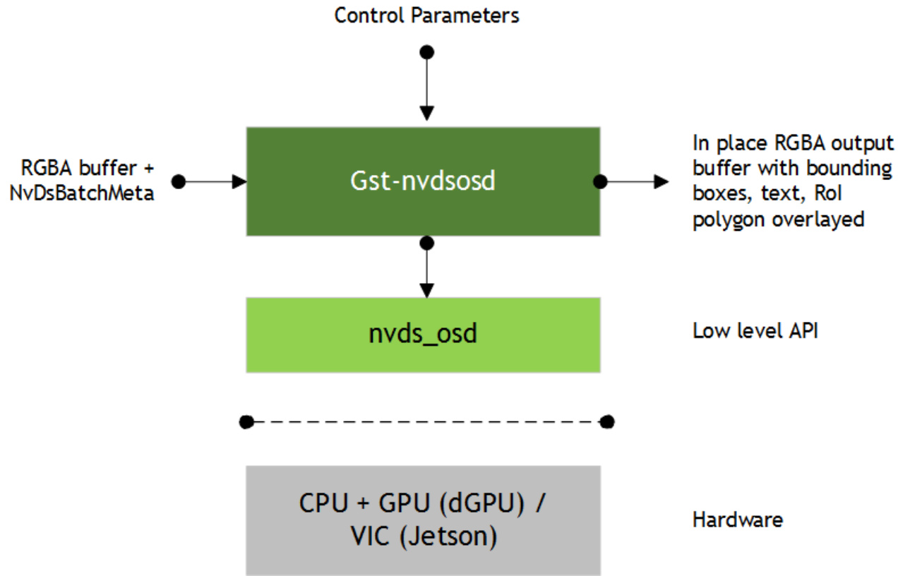
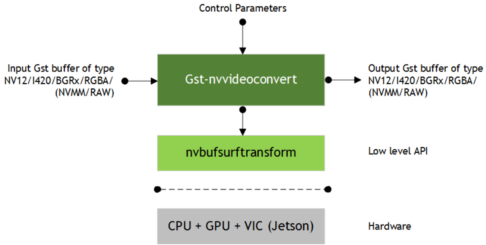
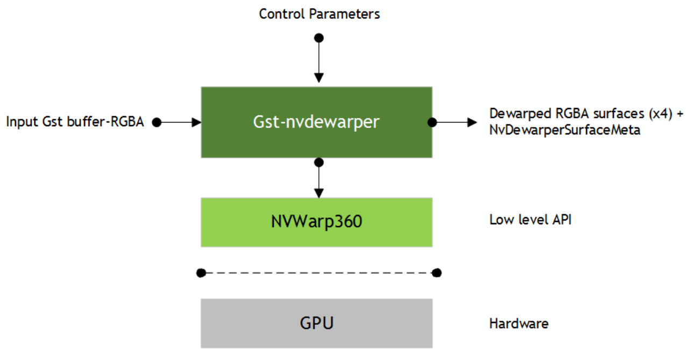
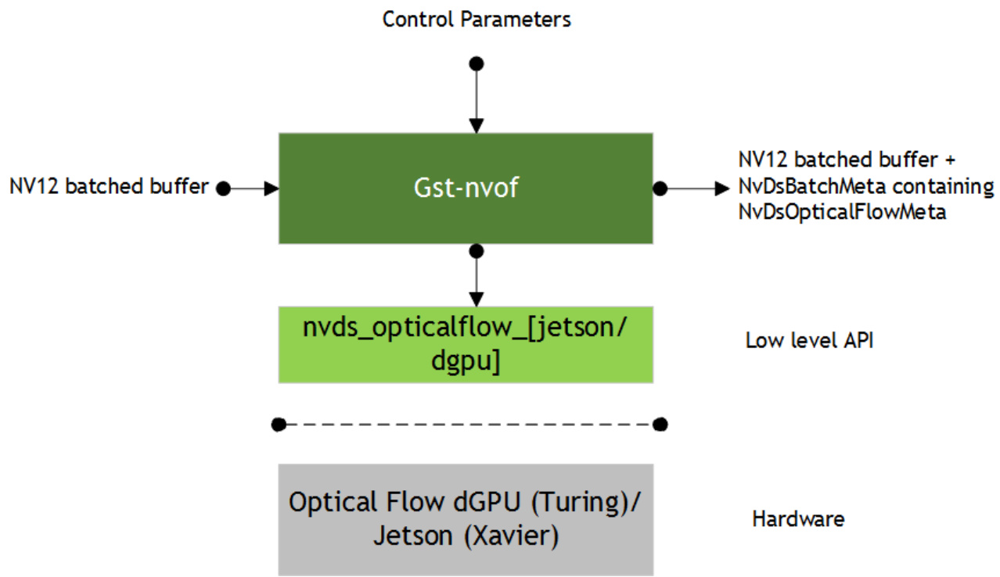
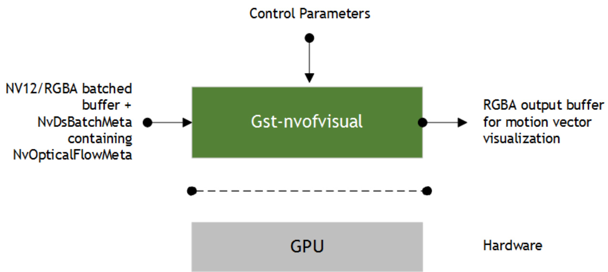
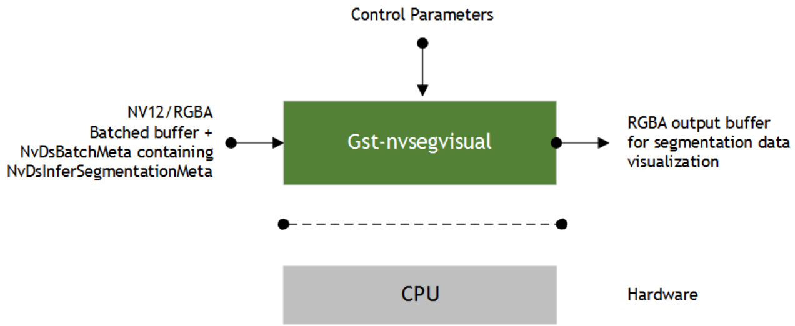
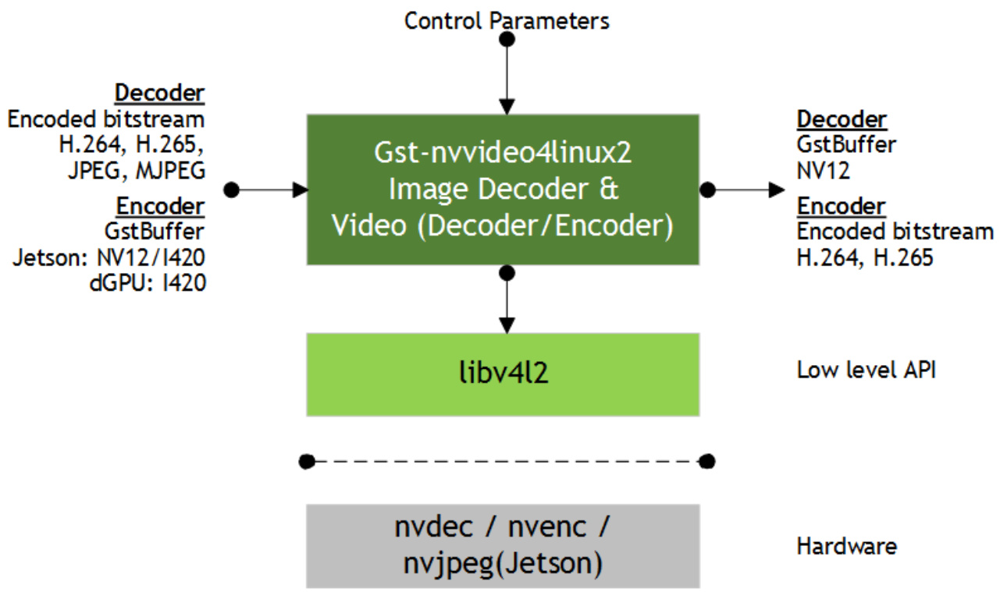

configuration (e.g. width, color, and opacity) of a given bounding box. It also draws text and RoI polygons at specified locations in the frame. Text and polygon parameters are configurable through metadata.  

  
Figure 6. The Gst-nvdsosd plugin  

# 2.6.1 Inputs and Outputs  

Inputs  

RGBA buffer   
NvDsBatchMeta (holds NvDsFrameMeta consisting of bounding boxes, text   
parameters, and lines parameters)   
NvDsLineMeta (RoI polygon)  

Control parameters gpu-id (dGPU only) display-clock clock-font clock-font-size x-clock-offset y-clock-offset clock-color  

Output  

RGBA buffer modified in place to overlay bounding boxes, texts, and polygons represented in the metadata  

## 2.6.2 Features  

Table 13 summarizes the features of the plugin.  

Table 13. Features of the Gst-nvdsosd plugin   

<html><body><table><tr><td>Feature</td><td>Description</td><td>Release</td></tr><tr><td>Supports drawingpolygonlines</td><td></td><td>DS 3.0</td></tr><tr><td>Supports drawing text using Pango and Cairolibraries</td><td></td><td>DS2.0</td></tr><tr><td>VIC (Jetson only) and GPU support for drawingboundingboxes</td><td></td><td>DS2.0</td></tr></table></body></html>  

## 2.6.3 Gst Properties  

Table 14 describes the Gst properties of the Gst-nvdsosd plugin.  

Table 14. Gst-nvdsosd plugin, Gst Properties   

<html><body><table><tr><td>Property</td><td>Meaning</td><td>Type and Range</td><td>Example Notes</td></tr><tr><td>gpu-id</td><td>DeviceIDof the GPU tobeused for operation (dGPU only)</td><td>Integer, 0 to 4,294,967,295</td><td>gpu-id=0</td></tr><tr><td>display-clock</td><td>Indicates whether to display system clock</td><td>Boolean</td><td>display-clock=0</td></tr><tr><td>clock-font</td><td>Name of Pango font to use for the clock</td><td>String</td><td>clock-font=Arial</td></tr><tr><td>clock-font-size</td><td>Font size to use for the clock</td><td>Integer, 0-60</td><td>clock-font-size=2</td></tr><tr><td>x-clock-offset</td><td>X offset of the clock</td><td>Integer, 0 to 4,294,967,295</td><td>x-clock-offset=100</td></tr><tr><td>y-clock-offset</td><td>Y offset of the clock</td><td>Integer, 0 to 4,294,967,295</td><td>y-clock-offset=50</td></tr><tr><td>clock-color</td><td>Color ofthe clock tobeset while display, in the order OxRGBA</td><td>Integer, 0 to 4,294,967,295</td><td>clock-color=0xffooooff (Clock is red with alpha=1)</td></tr></table></body></html>  

# 2.7 GST-NVVIDEOCONVERT  

This plugin performs video color format conversion. It accepts NVMM memory as well as RAW (memory allocated using calloc() or malloc() ), and provides NVMM or RAW memory at the output.  

  
Figure 7. The Gst-nvvideoconvert plugin  

## 2.7.1 Inputs and Outputs  

Inputs Gst Buffer batched buffer NvDsBatchMeta  

Format: NV12, I420, BGRx, RGBA (NVMM/RAW)  

Control parameters  

gpu-id (dGPU only)   
nvbuf-memory-type   
src-crop   
dst-crop   
interpolation-method   
compute-hw  

Output  

Gst Buffer   
NvDsBatchMeta   
Format: NV12, I420, BGRx, RGBA (NVMM/RAW)  

## 2.7.2 Features  

This plugin supports batched scaling and conversion in single call for NVMM to NVMM, RAW to NVMM, and NVMM to RAW buffer types. It does not support RAW to RAW conversion. The plugin supports cropping of the input and output frames.  

## 2.7.3 Gst Properties  

Table 15 describes the Gst properties of the Gst-nvvideoconvert plugin.  

Table 15. Gst-nvvideoconvert plugin, Gst Properties   

<html><body><table><tr><td>Property</td><td>Meaning</td><td>Type and Range</td><td>Example Notes</td></tr><tr><td>nvbuf-memory- type</td><td>Type of memory to be allocated. For dGPU: 0 (nvbuf-mem-default): Default memory, cuda- device 1 (nvbuf-mem-cuda-pinned): Pinned/Host CUDA memory 2 (nvbuf-mem-cuda-device) Device CUDA memory 3 (nvbuf-mem-cuda- unified): Unified CUDA memory For Jetson: 0 (nvbuf-mem-default): Default memory, surface array</td><td>enum GstNvVidConvBufM emoryType</td><td></td></tr><tr><td>src-crop</td><td>4 (nvbuf-mem-surface- array): Surface array memory Pixel location:</td><td>String</td><td>20;40;150;100</td></tr><tr><td>dst-crop</td><td>left:top:width:height Pixel location: left:top:width:height</td><td>String</td><td>20;40;150;100</td></tr></table></body></html>  

<html><body><table><tr><td>Property</td><td>Meaning</td><td>Type and Range</td><td>Example Notes</td></tr><tr><td>interpolation- method</td><td>Interpolation method. 0: Nearest 1: Bilinear 2: Algo-1 (GPU—Cubic, VIC- 5 Tap) 3: Algo-2 (GPU—Super, VIC— 10 Tap) 4: Algo-3 (GPU—LanzoS, VIC- Smart) 5: Algo-4 (GPU—Ignored, VIC- Nicest) 6: Default (GPU-Nearest, VIC- Nearest)</td><td>enum GstlnterpolationMe thod</td><td>interpolation-method=1 Defaultvalueis6.</td></tr><tr><td>compute-hw</td><td>Type of computing hardware 0:Default (GPU for gDPU,VIC for Jetson) 1: GPU</td><td>enum GstComputeHW</td><td>compute-hw=0 Defaultvalue is 0.</td></tr><tr><td>gpu-id</td><td>2:VIC Device ID of GPU to use for format conversion</td><td>Integer, 0 to 4,294,967,295</td><td>gpu-id=0</td></tr><tr><td>output-buffers</td><td>Number of Output Buffers for the buffer pool</td><td>Unsigned integer, 1 to 4,294,967,295</td><td>output-buffers=4</td></tr></table></body></html>  

# 2.8 GST-NVDEWARPER  

This plugin dewarps $360^{\circ}$ camera input. It accepts $\mathtt{g p u-i d}$ and config-file as properties. Based on the selected configuration of surfaces, it can generate a maximum of four dewarped surfaces. It currently supports dewarping of two projection types, NVDS_META_SURFACE_FISH_PUSHBROOM and NVDS_META_SURFACE_FISH_VERTCYL. Both of these are used in 360-D use case.  

The plugin performs its function in these steps:  

1. Reads the configuration file and creates a vector of surface configurations. It supports a maximum of four dewarp surface configurations.   
2. Receives the 360-D frame from the decoder; based on the configuration, generates up to four dewarped surfaces.   
3. Scales these surfaces down to network / selected dewarper output resolution using NPP APIs.   
4. Pushes a buffer containing the dewarped surfaces to the downstream component.  

  
Figure 8. The Gst-nvdewarper plugin  

## 2.8.1 Inputs and Outputs  

Inputs A buffer containing a 360-D frame in RGBA format  

Control parameters  

gpu-id; selects the GPU ID (dGPU only) config-file, containing the pathname of the dewarper configuration file  

Output  

Dewarped RGBA surfaces NvDewarperSurfaceMeta with information associated with each surface (projection_type, surface_index, and source_id), and the number of valid dewarped surfaces in the buffer (num_filled_surfaces)  

## 2.8.2 Features  

Table 16 summarizes the features of the plugin.  

Table 16. Features of the Gst-nvdewarper plugin   

<html><body><table><tr><td>Feature</td><td>Description</td><td>Release</td></tr><tr><td>Configurenumberofdewarpedsurfaces</td><td>Supports a maximum of four dewarper surfaces.</td><td>DS3.0</td></tr></table></body></html>  

<html><body><table><tr><td>Feature</td><td>Description</td><td>Release</td></tr><tr><td>Configure per-surface projection type</td><td>Currently supports FishPushBroom and FishVertRadCyd projections.</td><td>DS 3.0</td></tr><tr><td>Configure per-surface index</td><td>Surface index to be set in case of multiple surfaces having same projection type.</td><td>DS 3.0</td></tr><tr><td>Configure per-surface width and height</td><td></td><td>DS 3.0</td></tr><tr><td>Configure per-surface dewarping parameters</td><td>Per-surface configurable yaw, roll, pitch, top angle, bottom angle, and focal length dewarping parameters.</td><td>DS 3.0</td></tr><tr><td>Configurable dewarper output resolution</td><td>Creates a batch of up to four surfaces of a specified output resolution; internally scales all dewarper surfaces to output resolution.</td><td>DS 3.0</td></tr><tr><td>Configurable NVDS CUDA memory type</td><td></td><td>DS 3.0</td></tr><tr><td>Multi-GPU support</td><td></td><td>DS 3.0</td></tr><tr><td>Aisleview CsVcalibration file support</td><td>If set, properties in the [surface<n>] group are ignored.</td><td>DS 3.0</td></tr><tr><td>Spot view CsV calibration file support</td><td>If set, properties in the [surface<n>] group are ignored.</td><td>DS 3.0</td></tr><tr><td>Configure source id</td><td>Sets the sourceID informationin the NvDewarperSurfaceMeta.</td><td>DS 4.0</td></tr><tr><td>Configurable number of output buffers</td><td>Number of allocated output dewarper buffers. Each buffer contains four dewarped output surfaces.</td><td>DS 4.0</td></tr></table></body></html>  

## 2.8.3 Configuration File Parameters  

The configuration file specifies per-surface configuration parameters in [surface<n>] groups, where $\mathrm{\ttcn>}$ is an integer from 0 to 3, representing dewarped surfaces 0 to 3.  

Table 17. Gst-nvdewarper plugin, configuration file, [surface<n>] parameters  

<html><body><table><tr><td>Property</td><td>Meaning</td><td>Type and Range</td><td>Example Notes</td></tr><tr><td>output-width</td><td>Scaledewarpedsurfacesto specifiedoutputwidth</td><td>Integer, >0</td><td>output-width=960</td></tr><tr><td>output-height</td><td>Scaledewarpedsurfacesto specified output height</td><td>Integer, >0</td><td>output-height=752</td></tr><tr><td>dewarp-dump- frames</td><td>Numberofdewarpedframesto dump.</td><td>Integer, >0</td><td>dewarp-dump-frames=10</td></tr><tr><td>projection-type</td><td>Selects projection type. Supported types are: 1:PushBroom 2:VertRadCyl</td><td>Integer, 1 or 2</td><td>projection-type=1</td></tr></table></body></html>  

<html><body><table><tr><td>Property</td><td>Meaning</td><td>Type and Range</td><td>Example Notes</td></tr><tr><td>surface-index</td><td>An index that distinguishes surfaces of the same projection type.</td><td>Integer, ≥0</td><td>surface-index=0</td></tr><tr><td>width</td><td>Dewarped surface width.</td><td>Integer, >0</td><td>width=3886</td></tr><tr><td>height</td><td>Dewarped surface height.</td><td>Integer, >0</td><td>height=666</td></tr><tr><td>top-angle</td><td>Top field of view angle, in degrees.</td><td>Float, -180.0 to 180.0</td><td>top-angle=0</td></tr><tr><td>bottom-angle</td><td>Bottom field of view angle, in degrees.</td><td>Float, -180.0 to 180.0</td><td>bottom-angle=0</td></tr><tr><td>pitch</td><td>Viewing parameter pitch in degrees.</td><td>Float, 0.0 to 360.0</td><td>pitch=90</td></tr><tr><td>yaw</td><td>Viewing parameter yaw in degrees.</td><td>Float, 0.0 to 360.0</td><td>yaw=0</td></tr><tr><td>roll</td><td>Viewing parameter roll in degrees.</td><td>Float, 0.0 to 360.0</td><td>roll=0</td></tr><tr><td>focal-length</td><td>Focal length of camera lens, in pixels per radian. Pathname of the configuration</td><td>Float, >0.0</td><td>focal-length=437</td></tr><tr><td>aisle-calibration- file</td><td>filefor aisleview.Set forthe 360-D application only. If set, properties in the [surface<n>] group are ignored. The configuration file is a CSV file with columns like sensorId and cameraId, and dewarping parameters like top-angle,bottom-angle, yaw, roll,pitch, focal- length, width, and height. Pathname of the configuration</td><td>String</td><td>aisle-calibration-file= csv_files/nvaisle_2M.csv</td></tr><tr><td>spot-calibration- file</td><td>file for spot view. Set for the 360-D application only. If set, properties in the [surface<n>] group are ignored. The configuration file is a CSV file with columns like sensorId and cameraId, and dewarping parameters like top-angle,bottom-angle, yaw, roll,pitch, focal- length, width, and height.</td><td>String</td><td>spot-calibration-file= csv_files/nvspot_2M.csv Foranexampleofaspot viewconfigurationfile,see thefileintheexample above.</td></tr></table></body></html>  

This plugin can be tested with the one of the following pipelines.  

For dGPU:  

gst-launch-1.0 filesrc location $\varepsilon$ streams/sample_cam6.mp4 ! qtdemux ! h264parse ! nvv4l2decoder ! nvvideoconvert ! nvdewarper configfile $=$ config_dewarper.txt source-id $=6$ nvbuf-memory-type $^{=3}$ ! m.sink_0 nvstreammux name ${\overline{{-}}}\mathbf{m}$ width $=960$ height $=752$ batch-size ${=}4$ num-surfacesper-frame ${=}4$ ! nvmultistreamtiler ! nveglglessink  

For Jetson:  

gst-launch-1.0 filesrc location $=$ streams/sample_cam6.mp4 ! qtdemux ! h264parse ! nvv4l2decoder  ! nvvideoconvert  ! nvdewarper configfile $=$ config_dewarper.txt source-id $=6$ ! m.sink_0 nvstreammux name ${\overline{{-}}}\mathbf{m}$ widt $\mathtt{h}{=}960$ height $=752$ batch-si $z\in=4$ num-surfaces-per-frame ${=}4$ ! nvmultistreamtiler ! nvegltransform ! nveglglessink  

The Gst-nvdewarper plugin always outputs a GStreamer buffer which contains the maximum number of dewarped surfaces (currently four surfaces are supported). These dewarped surfaces are scaled to the output resolution (output-width $\times$ outputheight) set in the configuration file located at configs/deepstreamapp/config_dewarper.txt.  

Also, the batch size to be set on Gst-nvstreammux must be a multiple of the maximum number of dewarped surfaces (currently four).  

## 2.8.4 Gst Properties  

Table 18 describes the Gst-nvdewarper plugin’s Gst properties.  

Table 18. Gst-nvdewarper plugin, Gst properties   

<html><body><table><tr><td>Property</td><td>Meaning</td><td>Type and Range</td><td>Example and Notes</td></tr><tr><td>config-file</td><td>Absolutepathnameofconfiguration file for theGst-nvdewarper element</td><td>String</td><td>config-file= configs/ deepstream-app/ config_dewarper.txt</td></tr><tr><td>gpu-id</td><td>DeviceIDoftheGPUtobeused (dGPU only)</td><td>Integer, 0to4,294,967,295</td><td>gpu-id=0</td></tr><tr><td>source-id</td><td>Source ID, e.g. camera ID</td><td>Integer, 0to4,294,967,295</td><td>source-id=6</td></tr><tr><td>num-output- buffers</td><td>Number ofoutputbuffers tobe allocated</td><td>Integer, 0to4,294,967,295</td><td>num-output-buffers=4</td></tr></table></body></html>  

<html><body><table><tr><td>Property</td><td>Meaning</td><td>Type and Range</td><td>Example and Notes</td></tr><tr><td>nvbuf-memory- type</td><td>Type of memory to be allocated. For dGPU: 0 (nvbuf-mem-default): Default memory, cuda-device 1 (nvbuf-mem-cuda-pinned): Pinned/Host CUDA memory 2 (nvbuf-mem-cuda-device) Device CUDA memory 3 (nvbuf-mem-cuda-unified): Unified CUDAmemory For Jetson: 0 (nvbuf-mem-default): Default memory, surface array 4 (nvbuf-mem-surface-array):</td><td>Integer, 0 to 4</td><td>nvbuf-memory-type=3</td></tr></table></body></html>  

# 2.9 GST-NVOF  

NVIDIA GPUs, starting with the dGPU Turing generation and Jetson Xavier generation, contain a hardware accelerator for computing optical flow. Optical flow vectors are useful in various use cases such as object detection and tracking, video frame rate upconversion, depth estimation, stitching, and so on.  

The gst-nvof plugin collects a pair of NV12 images and passes it to the low-level optical flow library. The low-level library returns a map of flow vectors between the two frames as its output.  

The map of flow vectors is encapsulated in the NvDsOpticalFlowMeta structure and is added as a user meta with meta_type set to NVDS_OPTICAL_FLOW_META. The user meta is added to the frame_user_meta_list member of NvDsFrameMeta.  

For guidance on how to access user metadata, see User/Custom Metadata Addition inside NvDsBatchMeta and Tensor Metadata.  

  
Figure 9. The Gst-nvof plugin  

## 2.9.1 Inputs and Outputs  

Inputs  

GStreamer buffer containing NV12 frame(s)  

Control parameters  

gpu-id: selects the GPU ID (valid only for dGPU platforms)   
dump-of-meta: enables dumping of optical flow map vector into a .bin file   
preset-level: sets the preset level   
pool-size: sets the pool size   
grid-size: sets the grid size  

Outputs  

GStreamer buffer containing NV12 frame(s) NvDsOpticalFlowMeta metadata  

## 2.9.2 Features  

Table 19 summarizes the features of the plugin.  

Table 19. Features of the Gst-nvof plugin   

<html><body><table><tr><td>Feature</td><td>Description</td><td>Release</td></tr><tr><td>ConfigureGPUselection</td><td>Sets the gpu ID to be used for optical flowoperation (validonlyfordGPUplatforms)</td><td>DS 4.0</td></tr><tr><td>Configuredumpingofoptical flowmetadata</td><td>Enables dumping of optical flow output(motionvector data)</td><td>DS 4.0</td></tr><tr><td>Configure preset level</td><td>Setsthedesiredpresetlevel</td><td>DS 4.0</td></tr><tr><td>Configuregrid size</td><td>Setstheflowvectorblocksize</td><td>DS 4.0</td></tr></table></body></html>  

## 2.9.3 Gst Properties  

Table 20 describes the Gst properties of the Gst-nvof plugin.  

Table 20. Gst-nvof plugin, Gst properties   

<html><body><table><tr><td>Property</td><td>Meaning</td><td>Type and Range</td><td>Example Notes</td></tr><tr><td>gpu-id</td><td>DeviceIDoftheGPUtobeused for decoding (dGPU only).</td><td>Integer, 0 to 4,294,967,295</td><td>gpu-id=0</td></tr><tr><td>dump-of-meta</td><td>Dumps optical flow output into a .bin file. Selects a preset level,default preset</td><td>Boolean</td><td>dump-of- meta=1</td></tr><tr><td>preset-level</td><td>level is Oi.e.NV_OF_PERF_LEVEL_FAST Possiblevalues are: 0 (NV_OF_PERF_LEVEL_FAST): high performance, low quality. 1 (NV_OF_PERF_LEVEL_MEDIUM): intermediate performance and quality. 2 (NV_OF_PERF_LEVEL_SLOW): low performance, best quality (valid only for dGPU platforms).</td><td>Enum, 0 to 2</td><td>preset-level=0</td></tr><tr><td>grid-size</td><td>Selects the grid size. The hardware generates flow vectors blockwise, one vectorforeachblockof4x4pixels. Currently only the 4x4 grid size is supported.</td><td>Enum, 0</td><td>grid-size=0</td></tr><tr><td>pool-size</td><td>Sets the number of internal motion vector output buffers to be allocated.</td><td>Integer, 1 to 4,294,967,295</td><td>pool-size=7</td></tr></table></body></html>  

# 2.10 GST-NVOFVISUAL  

The Gst-nvofvisual plugin is useful for visualizing motion vector data. The visualization method is similar to the OpenCV reference source code in:  

https://github.com/opencv/opencv/blob/master/samples/gpu/optical_flow.c pp  

The plugin solves the optical flow problem by computing the magnitude and direction of optical flow from a two-channel array of flow vectors. It then visualizes the angle (direction) of flow by hue and the distance (magnitude) of flow by value of Hue Saturation Value (HSV) color representation. The strength of HSV is always set to a maximum of 255 for optimal visibility.  

  
Figure 10. The Gst-nvofvisual plugin  

## 2.10.1 Inputs and Outputs  

Inputs  

GStreamer buffer containing NV12/RGBA frame(s)   
NvDsOpticalFlowMeta containing the motion vector (MV) data generated by   
the gst-nvof plugin  

Control parameters gpu-id, selects the GPU ID  

Output  

GStreamer buffer containing RGBA frame(s)  

RGBA buffer generated by transforming MV data into color-coded RGBA image reference  

## 2.10.2 Features  

Table 21 summarizes the features of the plugin.  

Table 21. Features of the Gst-nvofvisual plugin   

<html><body><table><tr><td>Feature</td><td>Description</td><td>Release</td></tr><tr><td>ConfigureGPUselection</td><td>SetstheGPUIDtobeusedforopticalflowvisualization operations (valid only for dGPU platforms)</td><td>DS4.0</td></tr></table></body></html>  

## 2.10.3 Gst Properties  

Table 22 describes the Gst properties of the Gst-nvofvisual plugin.  

Table 22. Gst-nvofvisual plugin, Gst Properties  

<html><body><table><tr><td>Property</td><td>Meaning</td><td>Type and Range</td><td>Example Notes</td></tr><tr><td>gpu-id</td><td>DeviceIDoftheGPUtobeused (dGPUonly)</td><td>Integer, 0to4,294,967,295</td><td>gpu-id=0</td></tr></table></body></html>  

# 2.11 GST-NVSEGVISUAL  

The Gst-nvsegvisual plugin visualizes segmentation results. Segmentation is based on image recognition, except that the classifications occur at the pixel level as opposed to the image level as with image recognition. The segmentation output size is generally same as the input size.  

For more information, see the segmentation training reference at:  

https://github.com/qubvel/segmentation_models  

  
Figure 11. The Gst-nvsegvisual plugin  

## 2.11.1 Inputs and Outputs  

Inputs  

GStreamer buffer containing NV12/RGBA frame(s)   
NvDsInferSegmentationMeta containing class numbers, pixel class map, width, height, etc. generated by gst-nvinfer.   
gpu-id: selects the GPU ID   
width, set according the segmentation output size   
height, set according the segmentation output size  

Output  

This plugin allocates different colors for different classes. For example, the industrial model’s output has only one representing defective areas. Thus defective areas and background have different colors. The semantic model outputs four classes with four different colors: car, pedestrian, bicycle, and background.  

This plugin shows only the segmentation output. It does not overlay output on the original NV12 frame.  

Table 23 summarizes the features of the plugin.  

Table 23. Features of the Gst-nvsegvisual plugin   

<html><body><table><tr><td>Feature</td><td>Description</td><td>Release</td></tr><tr><td>ConfigureGPUselection</td><td>SetstheGPUIDtobeusedforsegmentation visualization operations (valid only for dGPU platforms)</td><td>DS 4.0</td></tr><tr><td>Configurewidth</td><td>Setswidthaccordingtothesegmentationoutput size</td><td>DS 4.0</td></tr></table></body></html>  

<html><body><table><tr><td>Feature</td><td>Description</td><td>Release</td></tr><tr><td>Configure height</td><td>Sets height according to the segmentation output size</td><td>DS 4.0</td></tr></table></body></html>  

## 2.11.2 Gst Properties  

Table 24 describes the Gst properties of the Gst-nvsegvisual plugin.  

Table 24. Gst-nvsegvisual plugin, Gst Properties   

<html><body><table><tr><td>Property</td><td>Meaning</td><td>Type and Range</td><td>Example and Notes</td></tr><tr><td>gpu-id</td><td>DeviceIDoftheGPUtobeused for decoding</td><td>Integer, 0to4,294,967,295</td><td>gpu-id=0</td></tr><tr><td>width</td><td>Segmentationoutputwidth</td><td>Integer, 0to4,294,967,295</td><td>width=512</td></tr><tr><td>height</td><td>Segmentationoutputheight</td><td>Integer, 0to4,294,967,295</td><td>height=512</td></tr></table></body></html>  

# 2.12 GST-NVVIDEO4LINUX2  

DeepStream extends the open source V4L2 codec plugins (here called Gst-v4l2) to support hardware-accelerated codecs.  

  
Figure 12. The Gst-nvvideo4linux2 decoder plugin  

## 2.12.1 Decoder  

The OSS Gst-nvvideo4linux2 plugin leverages the hardware decoding engines on Jetson and DGPU platforms by interfacing with libv4l2 plugins on those platforms. It supports H.264, H.265, JPEG and MJPEG formats.  

The plugin accepts an encoded bitstream & NVDEC h/w engine to decoder the bitstream. The decoded output is in NV12 format.  

Note: When you use the v4l2 decoder use for decoding JPEG images, you must use the open source jpegparse plugin before the decoder to parse encoded JPEG images.  

### 2.12.1.1 Inputs and Outputs  

 Inputs  

An encoded bitstream. Supported formats are H.264, H.265, JPEG and MJPEG  

Control Parameters  

gpu-id   
num-extra-surfaces   
skip-frames   
cudadec-memtype  

drop-frame-interval  

Output  

Gst Buffer with decoded output in NV12 format  

### 2.12.1.2 Features  

<html><body><table><tr><td>Feature</td><td>Description</td><td>Release</td></tr><tr><td>Supports H.264 decode</td><td></td><td>DS 4.0</td></tr><tr><td>SupportsH.265 decode</td><td></td><td>DS 4.0</td></tr><tr><td>Supports JPEG/MJPEG decode</td><td></td><td>DS 4.0</td></tr><tr><td>User-configurable CUDA memory type (Pinned/Device/Unified) for outputbuffers</td><td></td><td>DS 4.0</td></tr></table></body></html>  

### 2.12.1.3 Configuration Parameters  

<html><body><table><tr><td>Property</td><td>Meaning</td><td>Type and Range</td><td>Example Notes</td><td>Platforms</td></tr><tr><td>gpu-id</td><td>DeviceIDof GPU to use for decoding.</td><td>Integer, 0 to 4,294,967,295</td><td>gpu-id=0</td><td>dGPU</td></tr><tr><td>num-extra- surfaces</td><td>Number ofsurfaces in addition to min decode surfaces given by the V4L2 driver.</td><td>Integer, 1 to 24</td><td>num-decode- surfaces=24 Default:0</td><td>dGPU Jetson</td></tr><tr><td>skip-frames</td><td>Type of frames to skip during decoding. Represented internally by enum SkipFrame. 0 (decode_all): decode all frames 1 (decode_non_ref): decode non-ref frames 2 (decode_key): decode key</td><td>Integer, 0,1,or 2</td><td>skip-frames=0 Default:0</td><td>dGPU Jetson</td></tr><tr><td>drop-frame- interval</td><td>frames Interval to drop the frames, e.g. a valueof5meansthedecoder receives every fifth frame, and others are dropped.</td><td>Integer, 1 to 30</td><td>Default:0</td><td>dGPU Jetson</td></tr><tr><td>cudadec-memtype</td><td>Memory type for CUDA decoder buffers. Represented internally by enum CudaDecMemType. 0 (memtype_device): Device 1 (memtype_pinned): Host Pinned 2 (memtype_unified): Unified</td><td>Integer, 0,1,or 2</td><td>cuda-memory- type=1 Default:2</td><td>dGPU</td></tr></table></body></html>  

## 2.12.2 Encoder  

The OSS Gst-nvvideo4linux2 plugin leverages the hardware accelerated encoding engine available on Jetson and dGPU platforms by interfacing with libv4l2 plugins on those platforms. The plugin accepts RAW data in I420 format. It uses the NVENC hardware engine to encode RAW input. Encoded output is elementary bitstream supported formats.  

### 2.12.2.1 Inputs and Outputs  

Inputs RAW input in I420 format  

Control parameters  

gpu-id (dGPU only)   
profile   
bitrate   
control-rate   
iframeinterval  

Output  

Gst Buffer with encoded output in H264, H265, VP8 or VP9 format.  

### 2.12.2.2 Features  

<html><body><table><tr><td>Feature</td><td>Description</td><td>Release</td></tr><tr><td>Supports H.264 encode</td><td></td><td>DS 4.0</td></tr><tr><td>Supports H.265 encode</td><td></td><td>DS 4.0</td></tr></table></body></html>  

### 2.12.2.3 Configuration Parameters  

<html><body><table><tr><td>Property</td><td>Meaning</td><td>Type and Range</td><td>Example Notes</td><td>Platforms</td></tr><tr><td>gpu-id</td><td>DeviceIDofGPUtoused.</td><td>Integer, 0to4,294,967,295</td><td>gpu-id=0</td><td>dGPU</td></tr><tr><td>bitrate</td><td>Sets bitratefor encoding,in bits/seconds.</td><td>Integer, 0 to 4,294,967,295</td><td>Default:4000000</td><td>dGPU Jetson</td></tr><tr><td>iframeinterval</td><td>Encoding intra-frame occurrence frequency.</td><td>Unsigned integer, 0 to 4,294,967,295</td><td>Default:30</td><td>dGPU Jetson</td></tr></table></body></html>  

<html><body><table><tr><td>Profile</td><td>H.264/H.265encoderprofile; representedinternallybyenum GstV4l2VideoEncProfileType. For H.264: 0 (GST_V4L2_H264_VIDENC_ BASELINE_PROFILE):Baseline 2 (GST_V4L2_H264_VIDENC_ MAIN_PROFILE): Main 4 (GST_V4L2_H264_VIDENC_ HIGH_PROFILE): High For H.265: 0 (GST_V4L2_H265_VIDENC_ MAIN_PROFILE): Main 1 (GST_V4L2_H265_VIDENC_ MAIN10_PROFILE):Main10</td><td>Valuesofenum GstV4l2VideoEn cProfileType</td><td>DefaultBaseline Default:0</td><td>dGPU Jetson</td></tr></table></body></html>  

# 2.13 GST-NVJPEGDEC  

The Gst-nvjpegdec plugin decodes images on both dGPU and Jetson platforms.  It is the preferred method for decoding JPEG images.  

On the dGPU platform this plugin is based on the libnvjpeg library, part of the CUDA toolkit. On Jetson it uses a platform-specific hardware accelerator.  

The plugin uses an internal software parser to parse JPEG streams. Thus there is no need to use a jpegparse open source plugin separately to parse the encoded frame.  

The plugin accepts a JPEG encoded bitstream and produces RGBA output on the dGPU platform, and produces I420 output on the Jetson platform.  

## 2.13.1 Inputs and Outputs  

Inputs Elementary JPEG  

Control parameters gpu-id (dGPU only) DeepStream (Jetson only)  

Output Gst Buffer with decoded output in RGBA format  