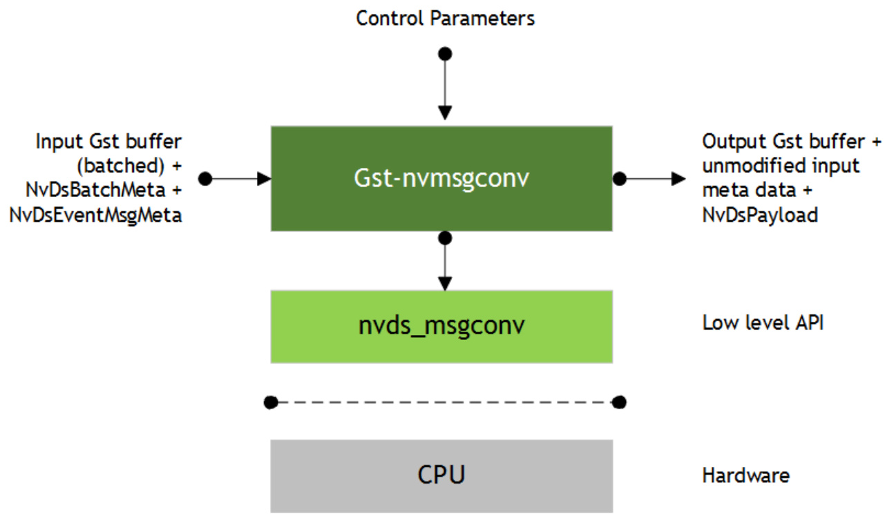
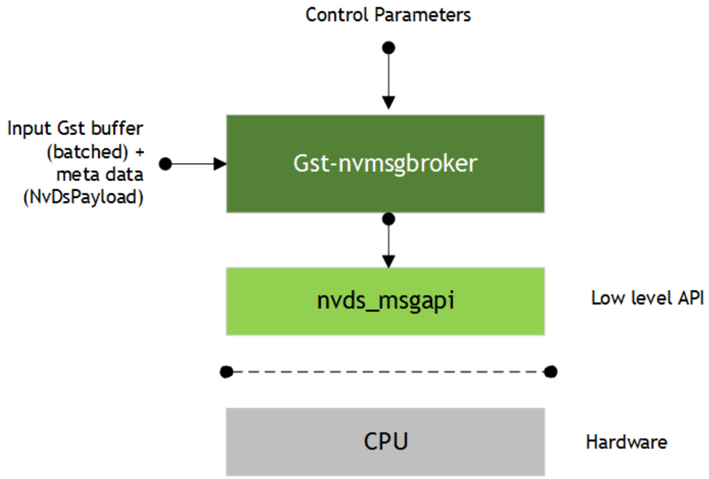
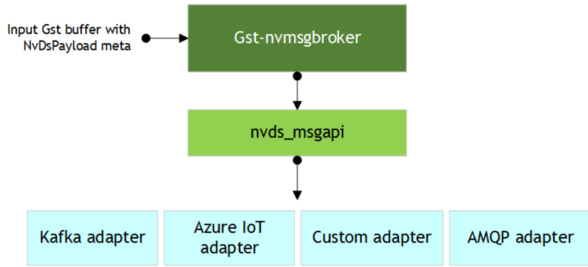

### 2.13.2 Features  

<html><body><table><tr><td>Feature</td><td>Description</td><td>Release</td></tr><tr><td>Supports JPEG Decode</td><td></td><td>DS 4.0</td></tr><tr><td>Supports MJPEGDecode</td><td></td><td>DS 4.0</td></tr></table></body></html>  

### 2.13.3 Configuration Parameters  

<html><body><table><tr><td>Property</td><td>Meaning</td><td>Type and Range</td><td>Example and Notes</td><td>Platforms</td></tr><tr><td>gpu-id</td><td>DeviceIDofGPUtousefor decoding. Applicable only for Jetson;</td><td>Integer, 0to4,294,967,295</td><td>gpu-id=0</td><td>dGPU</td></tr><tr><td>DeepStream</td><td>required for outputting buffer with new NvBufSurface or Legacy Buffer</td><td>Boolean</td><td>DeepStream=1</td><td>Jetson</td></tr></table></body></html>  

## 2.14 GST-NVMSGCONV  

The Gst-nvmsgconv plugin parses NVDS_EVENT_MSG_META (NvDsEventMsgMeta) type metadata attached to the buffer as user metadata of frame meta and generates the schema payload. For the batched buffer, metadata of all objects of a frame must be under the corresponding frame meta.  

The generated payload (NvDsPayload) is attached back to the input buffer as NVDS_PAYLOAD_META type user metadata.  

DeepStream 4.0 supports two variations of the schema, full and minimal. The Gstnvmsgconv plugin can be configured to use either one of the schemas.  

By default, the plugin uses the full DeepStream schema to generate the payload in JSON format. The full schema supports elaborate semantics for object detection, analytics modules, events, location, and sensor. Each payload has information about a single object.  

You can use the minimal variation of the schema to communicate minimal information with the back end. This provides a small footprint for the payload to be transmitted from DeepStream to a message broker. Each payload can have information for multiple objects in the frame.  

  
Figure 13. The Gst-nvmsgconv plugin  

### 2.14.1 Inputs and Outputs  

Inputs Gst Buffer with NvDsEventMsgMeta  

Control parameters config msg2p-lib payload-type comp-id  

Output  

Same Gst Buffer with additional NvDsPayload metadata. This metadata contains information about the payload generated by the plugin.  

### 2.14.2 Features  

Table 25 summarizes the features of the plugin.  

Table 25. Features of the Gst-nvmsgconv plugin   

<html><body><table><tr><td>Feature</td><td>Description</td><td>Release</td></tr><tr><td>Payload inJSONformat</td><td>Message payload is generated in JSON format</td><td>DS 3.0</td></tr><tr><td>Supports DeepStream schema specification</td><td>DeepStream schema specimplementation for messages</td><td>DS 3.0</td></tr><tr><td>Custom schema specification</td><td>Provision for custom schemas for messages</td><td>DS 3.0</td></tr><tr><td>Key-value file parsing for static properties</td><td>Read staticproperties of sensor/place/module in the form of key- valuepairfrom a textfile</td><td>DS 3.0</td></tr><tr><td>CSV file parsing for static properties</td><td>Read staticproperties of sensor/place/modulefromaCsVfile</td><td>DS 3.0</td></tr><tr><td>DeepStream4.0 minimalistic schema</td><td>MinimalvariationoftheDeepStream message schema</td><td>DS 4.0</td></tr></table></body></html>  

### 2.14.3 Gst Properties  

Table 26 describes the Gst-nvmsgconv plugin’s Gst properties.  

#### Table 26. Gst-nvmsgconv plugin, Gst properties  

<html><body><table><tr><td>Property</td><td>Meaning</td><td>Type and Range</td><td>Example Notes</td><td>Platforms</td></tr><tr><td>config</td><td>Absolute pathname of a configuration file that defines static properties of various sensors, places, and modules.</td><td>String</td><td>config=msgconv_ config.txt or config=msgconv_ config.csv</td><td>dGPU Jetson</td></tr><tr><td>msg2p-lib</td><td>Absolute pathname of the library containing a custom implementation ofthe nvds_msg2p_* interface for custom payload generation.</td><td>String</td><td>msg2p-lib=libnvds_ msgconv_custom.so</td><td>dGPU Jetson</td></tr><tr><td>payload-type</td><td>Type of schema payload to be generated. Possible values are: PAYLOAD_DEEPSTREAM: Payload using DeepStream schema. PAYLOAD_DEEPSTREAM_MINI MAL: Payload using minimal DeepStream schema. PAYLOAD_CUSTOM: Payload using custom schemas.</td><td>Integer, 0 to 4,294,967,295</td><td>payload-type=0 or payload-type=257</td><td>dGPU Jetson</td></tr></table></body></html>  

<html><body><table><tr><td>Property</td><td>Meaning</td><td>TypeandRange</td><td>Example Notes</td><td>Platforms</td></tr><tr><td>comp-id</td><td>Component ID of the plugin fromwhichmetadataistobe processed.</td><td>Integer, 0to4,294,967,295</td><td>comp-id=2 Defaultis NvDsEventMsgMeta</td><td>dGPU Jetson</td></tr></table></body></html>  

### 2.14.4 Schema Customization  

This plugin can be used to implement a custom schema in two ways:  

By modifying the payload generator library: To perform a simple customization of DeepStream schema fields, modify the low level payload generation library file sources/libs/nvmsgconv/nvmsgconv.cpp.   
By implementing the nvds_msg2p interface: If a library that implements the custom schema needs to be integrated with the DeepStream SDK, wrap the library in the nvds_msg2p interface and set the plugin’s msg2p-lib property to the library’s name. Set the payload-type property to PAYLOAD_CUSTOM.  

See sources/libs/nvmsgconv/nvmsgconv.cpp for an example implementation of the nvds_msg2p interface.  

### 2.14.5 Payload with Custom Objects  

You can add a group of custom objects to the NvDsEventMsgMeta structure in the extMsg field and specify their size in the extMsgSize field. The meta copy (copy_func) and free (release_func) functions must handle the custom fields accordingly.  

The payload generator library handles some standard types of objects (Vehicle, Person, Face, etc.) and generates the payload according to the schema selected. To handle custom object types, you must modify the payload generator library nvmsgconv.cpp.  

See deepstream-test4 for details about adding custom objects as NVDS_EVENT_MSG_META user metadata with buffers for generating a custom payload to send to back end.  

## 2.15 GST-NVMSGBROKER  

This plugin sends payload messages to the server using a specified communication protocol. It accepts any buffer that has NvDsPayload metadata attached, and uses the nvds_msgapi_\* interface to send the messages to the server. You must implement the  

nvds_msgapi_\* interface for the protocol to be used and specify the implementing library in the proto-lib property.  

  
Figure 14. The Gst-nvmsgbroker plugin  

### 2.15.1 Inputs and Outputs  

Inputs Gst Buffer with NvDsPayload  

Control parameters Config conn-str proto-lib comp-id topic  

Output  

None, as this is a sink type component  

### 2.15.2 Features  

Table 27 summarizes the features of the Gst-nvmsgbroker plugin.  

Table 27. Features of the Gst-nvmsgbroker plugin   

<html><body><table><tr><td>Feature</td><td>Description</td><td>Release</td></tr><tr><td>Payload in JSONformat</td><td>Accepts message payload in JSON format</td><td>DS 3.0</td></tr><tr><td>Kafka protocol support</td><td>Kafka protocol adapter implementation</td><td>DS 3.0</td></tr><tr><td>Azure IOT support</td><td>IntegrationwithAzureIOTframework</td><td>DS 4.0</td></tr><tr><td>AMQP support</td><td>AMQP0-9-1protocoladapter implementation</td><td>DS 4.0</td></tr><tr><td>Custom protocol support</td><td>Provision to support custom protocol through a custom implementation of the adapterinterface</td><td>DS 3.0</td></tr><tr><td>Configurableparameters</td><td>Protocol specific options through configuration file</td><td>DS 3.0</td></tr></table></body></html>  

### 2.15.3 Gst Properties  

Table 28 describes the Gst properties of the Gst-nvmsgbroker plugin.  

Table 28. Gst-nvmsgbroker plugin, Gst Properties   

<html><body><table><tr><td>Property</td><td>Meaning</td><td>Type and Range</td><td>Example Notes</td><td>Platforms</td></tr><tr><td>config</td><td>Absolutepathnameof configuration file required by nvds_msgapi_* interface</td><td>String</td><td>config=msgapi_ config.txt</td><td>dGPU Jetson</td></tr><tr><td>conn-str</td><td>Connection string as end point for communication with server</td><td>String Format must be <name>;<port>; <topic-name></td><td>conn-str=foo.bar.com;80 or conn-str=foo.bar.com; 80;dsapp1</td><td>dGPU Jetson</td></tr><tr><td>proto-lib</td><td>Absolutepathnameoflibrary that contains the protocol adapter as an implementation of nvds_msgapi_*</td><td>String</td><td>proto-lib=libnvds_ kafka_proto.so</td><td>dGPU Jetson</td></tr><tr><td>comp-id</td><td>ID of component from which metadata should beprocessed</td><td>Integer, 0 to 4,294,967,295</td><td>comp-id=3 Default:plugin processesmetadata from any component</td><td>dGPU Jetson</td></tr><tr><td>topic</td><td>Message topic name</td><td>String</td><td>topic=dsapp1</td><td>dGPU Jetson</td></tr></table></body></html>  

### 2.15.4 nvds_msgapi: Protocol Adapter Interface  

You can use the NVIDIA DeepStream messaging interface, nvds_msgapi, to implement a custom protocol message handler and integrate it with DeepStream applications. Such a message handler, known as a protocol adapter, enables you to integrate DeepStream applications with backend data sources, such as data stored in the cloud.  

  

Figure 15. The Gst-nvmsgbroker plugin calling the nvds_msgapi interface  

The Gst-nvmsgbroker plugin calls the functions in your protocol adapter as shown in Figure 15. These functions support:  

Creating a connection   
Sending messages by synchronous or asynchronous means   
Terminating the connection   
Coordinating the client’s and protocol adapter’s use of CPU resources and threads   
Getting the protocol adapter’s version number  

The nvds_msgapi interface is defined in the header file source/includes/nvds_msgapi.h. This header file defines a set of function pointers which provide an interface analogous to an interface in $\subset++$ .  

The following sections describe the methods defined by the nvds_msgapi interface.  

#### 2.15.4.1 nvds_msgapi_connect(): Create a Connection  

NvDsMsgApiHandle nvds_msgapi_connect(char \*connection_str, nvds_msgapi_connect_cb_t connect_cb, char \*config_path );  

The function accepts a connection string and configures a connection. The adapter implementation can choose whether or not the function actually makes a connection to accommodate connectionless protocols such as HTTP.  

#### Parameters  

connection_str: A pointer to a string that specifies connection parameters in the general format "<url>;<port>;<specifier>".  

<url> and <port> specify the network address of the remote entity. <specifier $>$ specifies information specific to a protocol. Its content depends on the protocol’s implementation. It may be a topic for messaging, for example, or a client identifier for making the connection.  

Note that this connection string format is not binding, and a particular adapter may omit some fields (eg: specifier) from its format, provided the omission is described in its documentation.  

A special case of such connection string adaptation is where the adapter expects all connection parameters to be specified as fields in the configuration file (see config path below), in which case the connection string is passed as NULL.  

connect_cb: A callback function for events associated with the connection.  config_path: The pathname of a configuration file that defines protocol parameters used by the adapter.  

#### Return Value  

A handle for use in subsequent interface calls if successful, or NULL otherwise.  

2.15.4.2 nvds_msgapi_send() and nvds_msgapi_send_async(): Send an event  

NvDsMsgApiErrorType nvds_msgapi_send(NvDsMsgApiHandle \*h_ptr, char \*topic, uint8_t \*payload, size_t nbuf   
);   
NvDsMsgApiErrorType nvds_msgapi_send_async(NvDsMsgApiHandle h_ptr, char \*topic, const uint8_t \*payload, size_t nbuf, nvds_msgapi_send_cb_t send_callback, void \*user_ptr   
);  

Both functions send data to the endpoint of a connection. They accept a message topic and a message payload.  

The nvds_send() function is synchronous. The nvds_msgapi_send_async() function is asynchronous; it accepts a callback function that is called when the “send” operation is completed.  

Both functions allow the API client to control execution of the adapter logic by calling nvds_msgapi_do_work(). See the description of the nvds_msgapi_do_work() function.  

#### Parameters  

h_ptr: A handle for the connection, obtained by a call to nvds_msgapi_connect() topic: A pointer to a string that specifies a topic for the message; may be NULL if topic is not meaningful for the semantics of the protocol adapter.   
payload: A pointer to a byte array that contains the payload for the message.   
nbuf: Number of bytes to be sent.   
send_callback: A pointer to a callback function that the asynchronous function calls when the “send” operation is complete. The signature of the callback function is of type nvds_msgapi_send_cb_t, defined as:   
typedef void (\*nvds_msgapi_send_cb_t)(void \*user_ptr,   
NvDsMsgApiErrorType completion_flag   
);  

Where the callback’s parameters are:  

user_ptr: The user pointer (user_ptr) from the call to nvds_msgapi_send() or nvds_msgapi_send_async() that initiated the “send” operation. Enables the callback function to identify the initiating call.   
completion_flag: A code that indicates the completion status of the asynchronous send operation.  

#### 2.15.4.3 nvds_msgapi_do_work(): Incremental Execution of Adapter Logic  

void nvds_msgapi_do_work();  

The protocol adapter must periodically surrender control to the client during processing of nvds_msgapi_send() and nvds_msgapi_send_async() calls. The client must periodically call nvsd_msgapi_do_work() to let the protocol adapter resume execution. This ensures that the protocol adapter receives sufficient CPU resources. The client can use this convention to control the protocol adapter’s use of multi-threading and thread scheduling. The protocol adapter can use it to support heartbeat functionality, if the underlying protocol requires that.  

The nvds_msgapi_do_work() convention is needed when the protocol adapter executes in the client thread. Alternatively, the protocol adapter may execute timeconsuming operations in its own thread. In this case the protocol adapter need not surrender control to the client, the client need not call nvsd_msgapi_do_work(), and the implementation of nvds_msgapi_do_work() may be a no-op.  

The protocol adapter’s documentation must specify whether the client must call nvds_msgapi_do_work(), and if so, how often.  

#### 2.15.4.4 nvds_msgapi_disconnect(): Terminate a Connection  

NvDsMsgApiErrorType nvds_msgapi_disconnect(NvDsMsgApiHandle h_ptr);  

The function terminates the connection, if the underlying protocol requires it, and frees resources associated with h_ptr.  

#### Parameters  

 h_ptr: A handle for the connection, obtained by a call to nvds_msgapi_connect().  

2.15.4.5 nvds_msgapi_getversion(): Get Version Number  

char \*nvds_msgapi_getversion();  

This function returns a string that identifies the nvds_msgapi version supported by this protocol adapter implementation. The string must use the format "<major>.<minor>", where $<\mathtt{m a j o r}>$ is a major version number and <minor> is a minor version number. A change in the major version number indicates an API change that may cause incompatibility. When the major version number changes, the minor version number is reset to 1.  

### 2.15.5 nvds_kafka_proto: Kafka Protocol Adapter  

The DeepStream 3.0 release includes a protocol adapter that supports Apache Kafka. The adapter provides out-of-the-box capability for DeepStream applications to publish messages to Kafka brokers.  

#### 2.15.5.1 Installing Dependencies  

The Kafka adapter uses librdkafka for the underlying protocol implementation. This library must be installed prior to use.  

To install librdkakfa, enter these commands:  

git clone https://github.com/edenhill/librdkafka.git   
cd librdkafka   
git reset --hard 7101c2310341ab3f4675fc565f64f0967e135a6a   
./configure   
make   
sudo make install   
sudo cp /usr/local/lib/librdkafka\* /opt/nvidia/deepstream/deepstream  
4.0/lib  