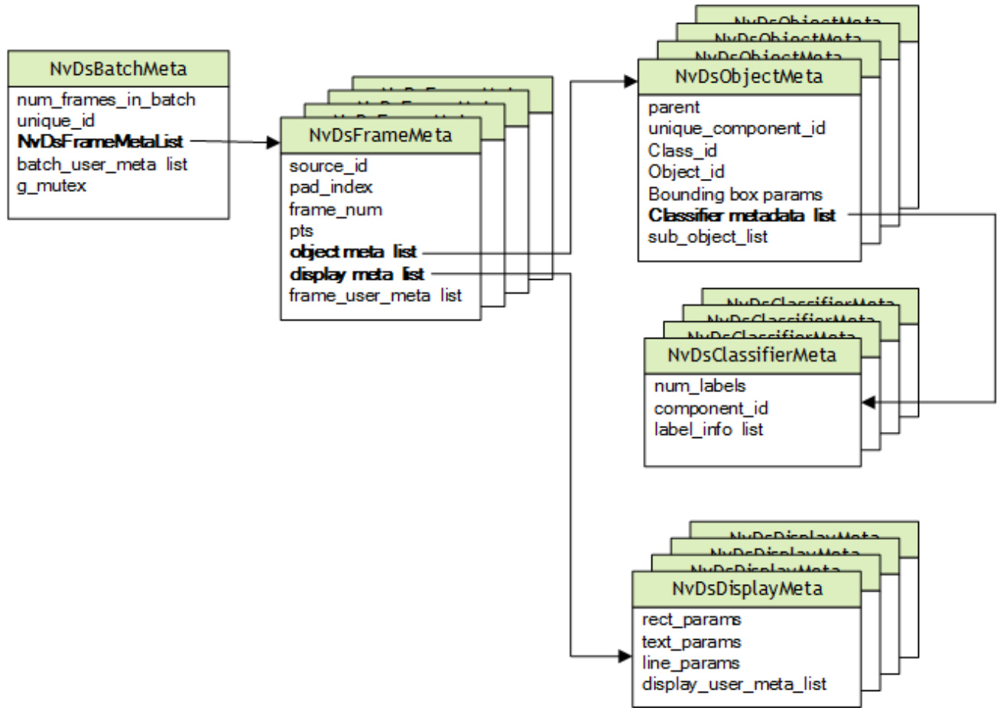

# Note:  

As stated at https://github.com/alanxz/rabbitmq-c#threading, you cannot share a socket, an amqp_connection_state_t, or a channel between threads using the librabbitmq library. This library is designed for use by event-driven, single-threaded applications, and does not yet meet the   
requirements of threaded applications.   
To deal with this limitation, your application must open an AMQP connection (and an associated socket) per thread. If it needs to access a single AMQP connection or any of its channels from more than one thread,   
you must implement an appropriate locking mechanism. It is generally simpler to have a connection dedicated to each thread.  

### 2.15.7.5 Monitor Adapter Execution  

The AMQP protocol adapter uses the nvds_logger framework to generate log messages which can help you monitor execution. The adapter generates separate logs for the INFO, DEBUG, and ERROR severity levels, as described in nvds_logger: Logging Framework. You can limit the log messages being generated by setting the level at which log messages are filtered in the logging setup script.  

Note: If the severity level is set to DEBUG, nvds_logger logs the entire contents of each message sent by the AMQP protocol adapter.  

### 2.15.8 nvds_logger: Logging Framework  

DeepStream provides a logging framework named nvds_logger. The Kafka protocol adapter uses this framework to generate a run time log. nvds_logger is based on syslog, and offers many related features, including:  

$\blacktriangleright$ Choice of priorities (log levels)   
$\blacktriangleright$ Log filtering and redirection   
$\blacktriangleright$ Shared logging across different DeepStream instances running concurrently   
$\blacktriangleright$ Log retirement and management using logrotate Cross-platform support  

#### 2.15.8.1 Enabling Logging  

To enable logging, run the setup_nvds_logger.sh script. Note that this script must be run with sudo. You may have to modify the permissions associated with this script to make it executable.  

The script accepts an optional parameter specifying the pathname of log file to be written. By default, the pathname is /tmp/nvds/ds.log.  

Once logging is enabled, you can access the generated log messages by reading the log file.  

By default, you must have sudo permissions to read the log file. Standard techniques for syslog-based logging configuration can eliminate this requirement.  

#### 2.15.8.2 Filtering Logs  

nvds_logger allows logs to be associate with a severity level similar to that which syslog offers. You can filter log messages based on severity level by modifying the setup script. By default, the script enables logging for messages at the INFO level (level 6) and above. You can modify this as outlined in the comments in the script:  

<html><body><table><tr><td>#</td><td></td><td></td></tr><tr><td>0</td><td>Emergency: system is unusable</td></tr><tr><td># 1</td><td>Alert: action must be taken immediately Critical: critical conditions</td></tr><tr><td># 2</td><td></td></tr><tr><td># 3</td><td>Error: error conditions</td></tr><tr><td># 4 Warning: warning conditions</td><td></td></tr><tr><td># 5</td><td>Notice: normal but significant condition</td></tr><tr><td># 6</td><td>Informational: informational messages</td></tr><tr><td>#</td><td>7 Debug: debug-level messages</td></tr></table></body></html>  

echo "if (\\$syslogtag contains 'DSLOG') and (\\$syslogseverity $<=~6~.$ ) then \$nvdslogfilepath" >> 11-nvds.conf  

#### 2.15.8.3 Retiring and Managing Logs  

It is recommended that you limit the size of log files by retiring them periodically. logrotate is a popular utility for this purpose. You can use it in cron jobs so that the log files are automatically archived periodically, and are discarded after a desired interval.  

#### 2.15.8.4 Generating Logs  

You can implement modules that use the logger by including sources/includes/nvds_logger.h in the source code and linking to the libnvds_logger.so library.  

Generating logs programmatically involves three steps:  

1. Call nvds_log_open() before you write any log messages.   
2. Call nvds_log() to write log messages.   
3. Call nvds_log_close() upon completion to flush and close the logs.  

Note the nvds_logger is a process-based logging mechanism, so the recommended procedure is to call nvds_log_open() from the main application routine rather than  

the individual plugins. Similarly, call nvds_log_close() from the main application when it shuts down the application before exit.  

## 3.0 METADATA IN THE DEEPSTREAM SDK  

Each Gst Buffer has associated metadata. The DeepStream SDK attaches the DeepStream metadata object, NvDsBatchMeta, described in the following sections.  

### 3.1 NVDSBATCHMETA: BASIC METADATA STRUCTURE  

DeepStream uses an extensible standard structure for metadata. The basic metadata structure NvDsBatchMeta starts with batch level metadata, created inside the Gstnvstreammux plugin. Subsidiary metadata structures hold frame, object, classifier, and label data. DeepStream also provides a mechanism for adding user-specific metadata at the batch, frame, or object level.  

DeepStream attaches metadata to a Gst Buffer by attaching an NvDsBatchMeta structure and setting GstNvDsMetaType.meta_type to NVDS_BATCH_GST_META in the Gst-nvstreammux plugin. When your application processes the Gst Buffer, it can iterate over the attached metadata to find NVDS_BATCH_GST_META.  

The function gst_buffer_get_nvds_batch_meta() extracts NvDsBatchMeta from the Gst Buffer. (See the declaration in sources/include/gstnvdsmeta.h.) See the deepstream-test1 sample application for an example of this function’s usage. For more details, see NVIDIA DeepStream SDK API Reference.  

  
Figure 16. DeepStream metadata hierarchy  

### 3.2 USER/CUSTOM METADATA ADDITION INSIDENVDSBATCHMETA  

To attach user-specific metadata at the batch, frame, or object level within NvDsBatchMeta, you must acquire an instance of NvDsUserMeta from the user meta pool by calling nvds_acquire_user_meta_from_pool(). (See sources/includes/nvdsmeta.h for details.) Then you must initialize NvDsUserMeta. The members you must set are user_meta_data, meta_type, copy_func, and release_func.  

For more details, see the sample application source code in sources/apps/sample_apps/deepstream-user-metadatatest/deepstream_user_metadata_app.c.  

### 3.3 ADDING CUSTOM META IN GST PLUGINS UPSTREAM FROM GST-NVSTREAMMUX  

The DeepStream SDK creates batch level metadata in the Gst-nvstreammux plugin. It holds NvDsBatchMeta metadata in a hierarchy of batches, frames within batches, and objects within frames.  

#### To add metadata to the plugin before Gst-nvstreammux  

This procedure introduces metadata to the DeepStream pipeline at a plugin before Gstnvstreammux.  

1. Set the plugin’s following members of the plugin’s NvDsUserMeta structure:  

copy_func   
free_func   
meta_type   
gst_to_nvds_meta_transform_func   
gst_to_nvds_meta_release_func  

2. Attach the metadata by calling gst_buffer_add_nvds_meta() and set the meta_type in the NvDsMeta instance returned by gst_buffer_add_nvds_meta().  

3. The Gst-nvstreammux plugin transforms the input gst-meta created in step 2 from the Gst Buffer into an NvDsUserMeta object associated with the corresponding NvDsFrameMeta object. It adds this object to the frame_user_data list.  

4. Search the frame_user_meta list in the NvDsFrameMeta object for the meta_type that was set in step 2, and access the attached metadata.  

See the sample application source code in   
sources/apps/sample_apps/deepstream-gst-metadata  
test/deepstream_gst_metadata.c for more details. If gst meta is not attached with gst_buffer_add_nvds_meta(),it is not transformed into DeepStream metadata. It is still be available in the Gst Buffer, though.  

## 4.0 IPLUGIN INTERFACE  

DeepStream 4.0 supports TensorRT™ plugins for custom layers. The Gst-nvinfer plugin now has support for the IPluginV2 and IPluginCreator interface, introduced in TensorRT 5.0. For caffemodels and for backward compatibility with existing plugins, it also supports the following interfaces:  

nvinfer1::IPluginFactory nvuffparser::IPluginFactory nvuffparser::IPluginFactoryExt nvcaffeparser1::IPluginFactory nvcaffeparser1::IPluginFactoryExt nvcaffeparser1::IPluginFactoryV2  

See the TensorRT documentation for details on new and deprecated plugin interfaces.  

### 4.1 HOW TO USE IPLUGINCREATOR  

To use the new IPluginCreator interface you must implement the interface in an independent custom library. This library must be passed to the Gst-nvinfer plugin through its configuration file by specifying the library’s pathname with the customlib-path key.  

Gst-nvinfer opens the library with dlopen(), which causes the plugin to be registered with TensorRT. There is no further direct interaction between the custom library and Gst-nvinfer. TensorRT calls the custom plugin functions as required.  

The SSD sample provided with the SDK provides an example of using the IPluginV2 and IPluginCreator interface. This sample has been adapted from TensorRT.  

### 4.2 HOW TO USE IPLUGINFACTORY  

To use the IPluginFactory interface, you must implement the interface in an independent custom library. Pass this library to the Gst-nvinfer plugin through the plugin’s configuration file by specifying the library’s pathname in the custom-libpath key. The custom library must implement the applicable functions:  

NvDsInferPluginFactoryCaffeGet NvDsInferPluginFactoryCaffeDestroy NvDsInferPluginFactoryUffGet NvDsInferPluginFactoryUffDestroy NvDsInferPluginFactoryRuntimeGet NvDsInferPluginFactoryRuntimeDestroy  

These structures are defined in nvdsinfer_custom_impl.h. The function definitions must be named as in the header file. Gst-nvinfer opens the custom library with dlopen() and looks for the names.  

#### For Caffe Files  

During parsing and building of a caffe network, Gst-nvinfer looks for NvDsInferPluginFactoryCaffeGet. If found, it calls the function to get the IPluginFactory instance. Depending on the type of IPluginFactory returned, Gst-nvinfer sets the factory using one of the ICaffeParser interface’s methods setPluginFactory(), setPluginFactoryExt(), or setPluginFactoryV2().  

After the network has been built and serialized, Gst-nvinfer looks for NvDsInferPluginFactoryCaffeDestroy and calls it to destroy the IPluginFactory instance.  

#### For Uff Files  

During parsing and building of a caffe network, Gst-nvinfer looks for NvDsInferPluginFactoryUffGet. If found, it calls the function to get the IPluginFactory instance. Depending on the type of IPluginFactory returned, Gst-nvinfer sets the factory using one of the IUffParser inteface’s methods setPluginFactory() or setPluginFactoryExt().  

After the network has been built and serialized, Gst-nvinfer looks for NvDsInferPluginFactoryUffDestroy and calls it to destroy the IPluginFactory instance.  

#### During Deserialization  

If deserializing the models requires an instance of NvInfer1::IPluginFactory, the custom library must also implement NvDsInferPluginFactoryRuntimeGet() and optionally NvDsInferPluginFactoryRuntimeDestroy(). During deserialization, Gst-nvinfer calls the library’s NvDsInferPluginFactoryRuntimeGet()  

function to get the IPluginFactory instance, then calls   
NvDsInferPluginFactoryRuntimeDestroy to destroy the instance if it finds that function during Gst-nvinfer deinitialization.  

The FasterRCNN sample provided with the SDK provides an example of using the IPluginV2 $^+$ nvcaffeparser1::IPluginFactoryV2 interface with DeepStream. This sample has been adapted from TensorRT. It also provides an example of using the legacy IPlugin $^+$ nvcaffeparser1::IPluginFactory $^+$ Gst-nvinfer 1::IPluginFactory interface for backward compatibility.  

## 5.0 DOCKER CONTAINERS  

DeepStream 4.0 provides Docker containers for both dGPU and Jetson platforms. These containers provide a convenient, out-of-the-box way to deploy DeepStream applications by packaging all associated dependencies within the container. The associated Docker images are hosted on the NVIDIA container registry in the NGC web portal at https://ngc.nvidia.com. They leverage the nvidia-docker package, which enables access to GPU resources from containers, as required by DeepStream applications. The rest of this section describes the features supported by the DeepStream Docker container for the dGPU and Jetson platforms.  

e: The DeepStream 4.0 containers for dGPU and Jetson are distinct, so you must take care to get the right image for your platform.  

### 5.1 A DOCKER CONTAINER FOR DGPU  

The Deeptream 4.0 container for dGPU is kept in the “Inference” section of the NGC web portal. The “Container” page gives instructions for pulling and running the container, along with a description of its contents.  

Unlike the container in DeepStream 3.0, the dGPU DeepStream 4.0 container supports DeepStream application development within the container. It contains the same build tools and development libraries as the DeepStream 4.0 SDK.  

In a typical scenario, you build, execute and debug a DeepStream application within the DeepStream container. Once your application is ready, you can create your own Docker container holding your application files (binaries, libraries, models, configuration file, etc.), using the DeepStream 4.0 container as a base image and adding your application  